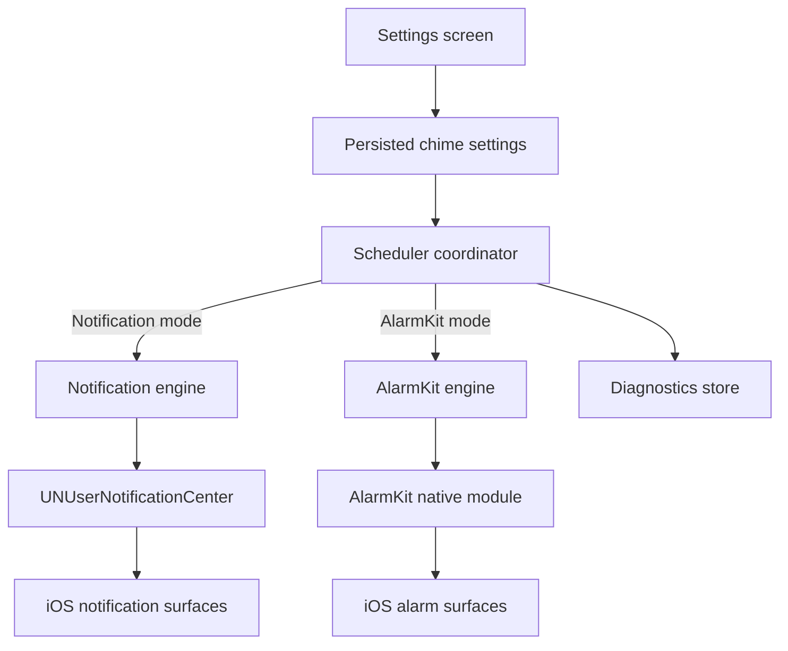
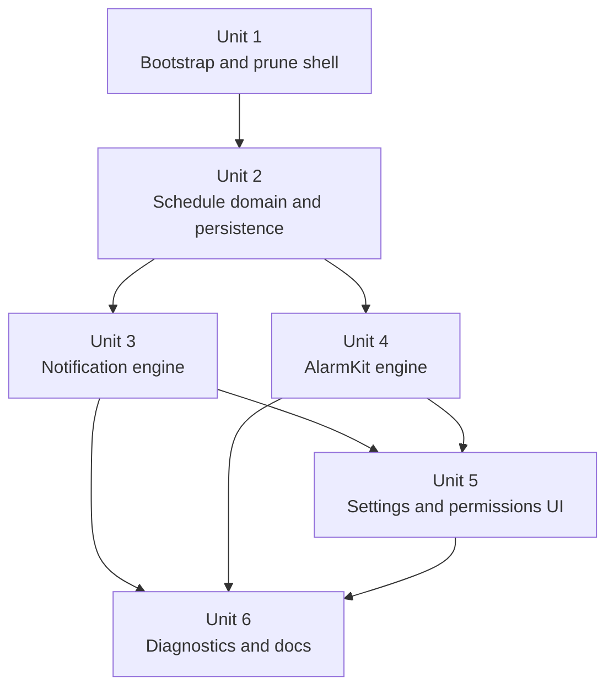
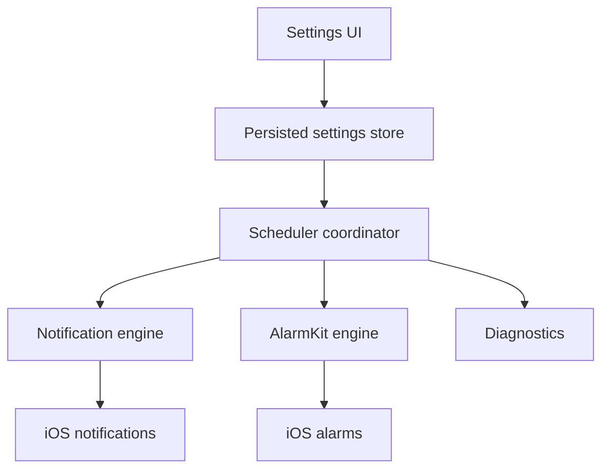

# feat: Build dual-mode hourly chime app

## Overview

Bootstrap a minimal iOS-first Expo app from a source shell, strip it down to a single-purpose hourly chime product, and implement two delivery engines against one shared settings model:

- **Notification mode** for broad support and a subtler Casio-watch feel
- **AlarmKit mode** for iOS 26+ system alarm behavior

The plan is optimized for real-device dogfooding. V1 keeps the mode switch visible, persists schedule and sound settings locally, and adds lightweight diagnostics so the team can compare reliability, notification-center clutter, and overall annoyance/prominence before choosing the long-term default.

## Problem Frame

The requirements document defines a deliberately small product: a brief recurring beep at selected times, with the strongest priority being delivery while the app is not actively open. The main product risk is that iOS does not offer a general-purpose hidden background sound mechanism. The viable system paths are local notifications and AlarmKit, and both have visible OS-level tradeoffs.

This repository currently has no app code, so planning must account for two realities at once:

1. The app needs a fast bootstrap path from an existing Expo/React Native shell.
2. The bootstrap must not import unrelated product concerns that would turn a simple chime app into a half-deleted source-app clone.

The technical design therefore centers on a **shared schedule domain model** that can drive multiple OS delivery backends while keeping the UI, persistence, and dogfooding workflow stable.

## Requirements Trace

- **R1-R7** — define the schedule model, presets, custom hours, sounds, and local-time behavior
- **R8-R15** — require both delivery modes, shared settings, mode switching, OS gating, and on-device comparison
- **R16-R20** — require native-feeling UI, a visible but temporary evaluation switch, and clear permission handling
- **R21-R24** — require local persistence, preferred jotai + expo-sqlite storage, optional future sync investigation, and enough evidence to choose a default mode

## Scope Boundaries

- No Android implementation in this pass
- No final app naming, iconography, or polish pass beyond what is needed to test the product honestly
- No iCloud-backed sync in V1
- No minute-level custom scheduling in V1
- No server-backed push-notification architecture
- No attempt to guarantee an invisible sound-only background mechanism if iOS platform behavior requires visible notification or alarm surfaces

### Deferred to Separate Tasks

- Android port after the iOS schedule and delivery model stabilizes
- Final removal of the public delivery-mode switch after dogfooding identifies the long-term default
- iCloud or cross-device sync once persistence feasibility is understood
- Brand identity work (app name, icon, copy polish)

## Context & Research

### Bootstrap Source and Cleanup Inventory

- **External inspiration repo:** an existing Expo app repo used as a shell reference. The plan names the repo rather than an absolute filesystem path so the document stays portable.
- **Copy baseline:** seed this repo from that source shell, but do **not** import dependency or generated native build artifacts such as `node_modules/`, `ios/`, `android/`, `.expo/`, or `dist/`.
- **Keep candidates from the source repo:** `package.json`, `app.config.ts`, `babel.config.js`, `index.js`, `tsconfig.json`, `src/app/_layout.tsx`, `src/utils/atomWithStorage.ts`, `src/storage/persist.ts`, and only the smallest useful provider/screen shell pieces.
- **Immediate removal pass after import:** `api/`, `maestro/`, `modules/expo-live-activity/`, `patches/`, `targets/`, `todos/`, copied docs/history artifacts, and unrelated source domains such as chat, huddle, inventory, agents, auth, analytics, feature flags, camera, location, and media-upload flows.
- **Inside-file cleanup focus:** strip source-app-specific concerns from `package.json`, `app.config.ts`, `src/app/_layout.tsx`, `src/utils/Providers/index.tsx`, `src/storage/persist.ts`, and `README.md`.

### Relevant Code and Patterns

- The current repo has no local app shell yet, so the bootstrap must create the initial structure.
- The source app provides reusable shell patterns for this repo once copied in and pruned:
  - `package.json` — Expo SDK 55 app scaffold and script layout
  - `app.config.ts` — config-plugin driven Expo app configuration
  - `src/app/_layout.tsx` — Expo Router startup shell
  - `src/utils/atomWithStorage.ts` — jotai + `expo-sqlite/kv-store` persistence pattern
  - `src/storage/persist.ts` — central persisted atom exports
  - `src/utils/Providers/index.tsx` — provider composition pattern, though most product-specific providers should be removed
- The copied app also contains large unrelated domains that should be explicitly removed rather than tolerated:
  - `src/features/agents/`
  - `src/features/chat/`
  - `src/features/huddle/`
  - `src/features/inventory/`
  - `api/`
  - `maestro/`
  - `modules/expo-live-activity/`
  - old docs, changelog, workflow, and release-management artifacts

### Institutional Learnings

- This repo currently has no `docs/solutions/` entries to reuse.
- The strongest local institutional guidance comes from the origin requirements doc and the explicit product decision to compare both delivery modes on-device before simplifying.

### External References

- Apple UserNotifications docs confirm that local notifications are delivered by the system even when the app is not running, and custom sounds must be bundled in the app or sound library locations.
- Apple `UNMutableNotificationContent` docs frame local notifications as user-facing interactions, reinforcing that notification mode cannot depend on a truly invisible background sound path.
- Apple `removeDeliveredNotifications(withIdentifiers:)` docs confirm that delivered notifications can be removed, but only through app-controlled code paths; this is not a safe correctness mechanism for a terminated app.
- Apple AlarmKit docs confirm:
  - framework availability on iOS 26+
  - fixed and timezone-relative scheduling
  - official sample emphasis on one-shot alarms and weekly recurrence
  - system-managed alarm UI and authorization requirements
- Apple DTS guidance on background execution explicitly says iOS has no general-purpose exact-time background execution and recommends using AlarmKit or local notifications for timer/alarm-style problems.
- Expo Notifications docs for SDK 55 support local scheduling and custom bundled sounds via config plugins.
- Early community AlarmKit Expo modules exist, but they are immature, iOS-26-only, App-Group-heavy integrations and are weaker foundations than a repo-owned narrow module for this product.

## Key Technical Decisions

| Decision                                                                                                                                             | Rationale                                                                                                                                          |
| ---------------------------------------------------------------------------------------------------------------------------------------------------- | -------------------------------------------------------------------------------------------------------------------------------------------------- |
| Use a **selective bootstrap + aggressive prune** strategy instead of building the shell from scratch or importing the full inspiration app unchanged | The repo is empty, so bootstrap accelerates delivery; selective pruning keeps scope aligned with a tiny single-purpose app                         |
| Define one canonical **`ChimeSettings` / schedule domain model** and treat Notification vs AlarmKit as interchangeable delivery engines              | The product explicitly needs side-by-side comparison without forcing users to rebuild schedules                                                    |
| Use **local notifications**, not push notifications, for notification mode                                                                           | The core need is closed-app on-device delivery, not remote orchestration; push adds server complexity without solving Notification Center concerns |
| Gate AlarmKit by **OS availability** instead of raising the whole app floor to iOS 26                                                                | Preserves broader iPhone coverage while still enabling honest comparison on newer devices                                                          |
| Build a **local Expo module** for AlarmKit under `modules/` rather than depending on a young third-party package                                     | The app needs a narrow, predictable bridge, and current community packages are too new to anchor product behavior                                  |
| Prefer **jotai + expo-sqlite** for persisted settings, with OS scheduled artifacts treated as derived state                                          | Matches user preference and existing shell patterns while keeping the app’s source of truth internal                                               |
| Add **lightweight in-app diagnostics** instead of heavy analytics                                                                                    | Dogfooding needs durable evidence, but the product should stay simple and privacy-light                                                            |

## Open Questions

### Resolved During Planning

- **Should V1 include both delivery engines?** Yes — both ship for evaluation.
- **Should the mode switch be visible?** Yes — visible in V1, explicitly temporary.
- **Should the schedule model be shared across engines?** Yes — engine swaps must preserve user intent.
- **Should V1 use push notifications?** No — keep delivery device-local.
- **Should the whole app become iOS 26+ only?** No — keep notification mode available on broader supported iOS versions, with AlarmKit added conditionally.

### Deferred to Implementation

- Exact deployment floor alignment with the copied Expo shell and current SDK support
- Final wording for permission education copy and mode-comparison copy
- Exact AlarmKit schedule materialization strategy for non-weekly cadences after real-device spike validation
- Exact notification grouping/cleanup choices once tested on real devices and current iOS behavior

## Output Structure

    assets/
      sounds/
        classic-beep.wav
        soft-beep.wav
        digital-beep.wav
    modules/
      expo-hour-chime-alarmkit/
        expo-module.config.json
        index.ts
        ios/
          ExpoHourChimeAlarmKitModule.swift
    src/
      app/
        _layout.tsx
        index.tsx
      components/
        settings/
          DeliveryModeSection.tsx
          DiagnosticsSection.tsx
          PermissionBanner.tsx
          ScheduleSection.tsx
          SoundSection.tsx
      features/
        chime/
          alarmkitEngine.ts
          atoms.ts
          diagnostics.ts
          notificationEngine.ts
          permissions.ts
          schedule.ts
          scheduler.ts
          types.ts
          schedule.test.ts
          notificationEngine.test.ts
          alarmkitEngine.test.ts
          diagnostics.test.ts
      storage/
        persist.ts

## High-Level Technical Design

> _This illustrates the intended approach and is directional guidance for review, not implementation specification. The implementing agent should treat it as context, not code to reproduce._

Key design implications:

- The UI edits only the persisted settings model.
- The coordinator is responsible for reconciling OS-level scheduled artifacts with that model on app start, settings changes, mode changes, and permission changes.
- Notification and AlarmKit engines should be thin adapters, not alternate sources of truth.
- Diagnostics should capture reconciliation outcomes and user-visible state, not become a full analytics subsystem.

## Implementation Units

- [x] **Unit 1: Bootstrap the repo and remove imported app baggage**

**Goal:** Seed this repository with the reusable Expo shell from an external source-app inspiration repo, then remove product domains, dependencies, and config that do not belong in a chime app.

**Requirements:** R16-R24

**Dependencies:** None

**Files:**

- Create/seed: `package.json`, `app.config.ts`, `babel.config.js`, `index.js`, `tsconfig.json`, `src/`, `assets/`, `plugins/`, `scripts/`, `README.md`
- Preserve current repo docs: `docs/brainstorms/2026-04-16-hourly-chime-app-requirements.md`
- Remove imported folders: `api/`, `maestro/`, `modules/expo-live-activity/`, `patches/`, `targets/`, `todos/`, `dist/`, `.eas/`, `.expo/`, `.opencode/`, `.claude/`, `.agents/`
- Remove imported source domains: `src/features/agents/`, `src/features/chat/`, `src/features/huddle/`, `src/features/inventory/`, `src/screens/`, `src/tests/mocks/launchdarkly.ts`
- Remove imported docs/artifacts: copied `docs/build-numbers.md`, old copied `docs/plans/`, old copied `docs/solutions/`, copied `CHANGELOG.md`, `CHANGELOG-internal.md`, `HACKS.md`, `NOTES.md`
- Modify and strip product concerns from: `package.json`, `app.config.ts`, `src/app/_layout.tsx`, `src/utils/Providers/index.tsx`, `src/storage/persist.ts`, `README.md`

**Approach:**

- Copy the external source app repo into this repo **without** `node_modules/`, `ios/`, and `android/`, then immediately reduce it to a minimal app shell.
- Remove old product concerns from top-level config and runtime startup code, especially:
  - Auth0/session flows
  - LaunchDarkly/feature flags
  - Sentry/Pendo/analytics
  - deep-linking for old routes
  - quick actions, widget navigation, live activities
  - camera, image-picker, recording, and location plugins
  - changelog, OTA, and app-variant release machinery that does not help V1
- Keep only the shell pieces that materially accelerate the new app: Expo Router startup, persistence helpers, safe-area/gesture scaffolding where still useful, and minimal assets/config structure.
- Collapse the route tree to a single public settings-first app flow.

**Patterns to follow:**

- `app.config.ts`
- `src/app/_layout.tsx`
- `src/utils/atomWithStorage.ts`
- `src/storage/persist.ts`

**Test scenarios:**

- Test expectation: none -- this unit is repository bootstrap and cleanup work; behavior is validated by later units.

**Verification:**

- The repo starts as a minimal Expo app shell with no leftover imported product screens, auth flow, backend coupling, or release-management clutter.

- [ ] **Unit 2: Define the schedule domain and persisted settings model**

**Goal:** Create one canonical settings and scheduling model that both delivery engines can consume.

**Requirements:** R1-R7, R9-R11, R18, R21-R24

**Dependencies:** Unit 1

**Files:**

- Create: `src/features/chime/types.ts`, `src/features/chime/schedule.ts`, `src/features/chime/atoms.ts`, `src/features/chime/scheduler.ts`, `src/features/chime/schedule.test.ts`
- Modify: `src/storage/persist.ts`, `src/utils/atomWithStorage.ts`
- Test: `src/features/chime/schedule.test.ts`

**Approach:**

- Define a canonical `ChimeSettings` model with enabled state, schedule kind, selected cadence/custom hours, selected sound, delivery mode, and lightweight permission/diagnostic state references.
- Keep the user-facing schedule definition separate from engine-specific materialization so notification requests and AlarmKit alarms can both be regenerated from the same source of truth.
- Normalize preset cadences and custom-hour schedules into deterministic “next occurrence” or “materialized firing windows” logic in one place.
- Treat local time as authoritative and explicitly recalculate future firings after timezone and clock shifts.

**Execution note:** Implement the schedule model test-first because later units depend on it for both correctness and parity.

**Technical design:** _(directional guidance, not implementation specification)_

- Canonical settings should describe **user intent**.
- Materializers should convert that intent into **OS artifacts**.
- Engine adapters should consume materialized artifacts, not re-interpret raw UI state independently.

**Patterns to follow:**

- `src/utils/atomWithStorage.ts`
- `src/storage/persist.ts`

**Test scenarios:**

- Happy path — selecting the hourly preset materializes hourly firing windows anchored to the current local time.
- Happy path — selecting custom hours `11` and `16` produces only `11:00` and `16:00` occurrences.
- Edge case — duplicate selected hours are deduplicated without changing user-visible intent.
- Edge case — schedules spanning `23:00` to the next day recalculate correctly after midnight.
- Edge case — timezone or daylight-saving shifts recalculate future firings against the new local clock.
- Error path — corrupted persisted settings fall back to safe defaults without crashing the app.
- Integration — switching delivery mode preserves the same stored schedule and sound choices.

**Verification:**

- A single persisted settings model can regenerate the same user intent consistently regardless of which delivery engine is active.

- [ ] **Unit 3: Add the notification delivery engine**

**Goal:** Schedule local chimes with bundled custom sounds and a best-effort low-clutter notification strategy.

**Requirements:** R8-R15, R18-R21

**Dependencies:** Unit 2

**Files:**

- Create: `src/features/chime/notificationEngine.ts`, `src/features/chime/permissions.ts`, `src/features/chime/notificationEngine.test.ts`, `assets/sounds/classic-beep.wav`, `assets/sounds/soft-beep.wav`, `assets/sounds/digital-beep.wav`
- Modify: `app.config.ts`, `package.json`, `src/app/_layout.tsx`, `src/features/chime/scheduler.ts`
- Test: `src/features/chime/notificationEngine.test.ts`

**Approach:**

- Add `expo-notifications`-based local scheduling and bundle short custom sounds through config-plugin setup.
- Centralize notification permission requests, denied-state mapping, and schedule reconciliation into one engine boundary.
- Materialize notification requests from the canonical schedule model and replace pending requests on app start, settings edits, and mode changes.
- Minimize Notification Center clutter through identifiers, grouping, and cleanup-on-reconciliation patterns, but do not depend on auto-removal after delivery for correctness.
- Keep this engine fully device-local; do not add push infrastructure.

**Execution note:** Start with failing contract tests for request generation and replacement behavior before wiring OS APIs.

**Patterns to follow:**

- `app.config.ts`
- `src/app/_layout.tsx`
- `src/features/chime/scheduler.ts`

**Test scenarios:**

- Happy path — enabling notification mode with the hourly preset schedules the expected notification artifacts using the selected sound.
- Happy path — changing from one sound to another reschedules future artifacts with the new sound.
- Happy path — switching from a preset cadence to custom hours removes stale requests and schedules only the new ones.
- Edge case — disabling chimes removes pending notification artifacts.
- Edge case — rehydrating app state after relaunch does not duplicate pending requests.
- Error path — denied notification permission leaves the app usable and surfaces remediation state instead of failing silently.
- Integration — switching away from notification mode tears down notification artifacts while preserving stored settings.

**Verification:**

- On a physical device, notification mode produces the configured chime while the app is closed and keeps OS artifacts synchronized to stored settings.

- [ ] **Unit 4: Add the AlarmKit delivery engine behind OS gating**

**Goal:** Integrate AlarmKit as an iOS 26+ alternative delivery engine through a repo-owned Expo module.

**Requirements:** R8-R15, R19-R20, R22-R24

**Dependencies:** Unit 2

**Files:**

- Create: `modules/expo-hour-chime-alarmkit/expo-module.config.json`, `modules/expo-hour-chime-alarmkit/index.ts`, `modules/expo-hour-chime-alarmkit/ios/ExpoHourChimeAlarmKitModule.swift`, `modules/expo-hour-chime-alarmkit/README.md`, `src/features/chime/alarmkitEngine.ts`, `src/features/chime/alarmkitEngine.test.ts`
- Modify: `package.json`, `app.config.ts`, `src/app/_layout.tsx`, `src/features/chime/scheduler.ts`
- Test: `src/features/chime/alarmkitEngine.test.ts`

**Approach:**

- Build a narrow local Expo module that exposes only the AlarmKit capabilities this app needs: authorization, schedule, cancel, list, and metadata needed to maintain parity with the app’s settings model.
- Gate AlarmKit at runtime and in the UI so unsupported OS versions never surface broken controls.
- Map canonical schedules into AlarmKit-friendly alarm artifacts. Because official docs emphasize fixed and weekly/timezone-relative scheduling, expect to materialize multiple alarms for cadences or custom-hour sets that do not map 1:1 onto a single AlarmKit recurrence.
- Keep the module intentionally small and product-owned rather than adopting a young third-party dependency as foundational infrastructure.

**Execution note:** Start with a narrow real-device spike and characterization coverage for schedule materialization before broadening the integration.

**Technical design:** _(directional guidance, not implementation specification)_

- `ChimeSettings` -> normalized firing windows -> AlarmKit artifact set + persisted id map.
- AlarmKit should remain an adapter layer; app semantics stay defined in JS/shared domain code.

**Patterns to follow:**

- `modules/expo-live-activity/` as a local Expo module scaffolding reference only
- `app.config.ts`
- `src/features/chime/scheduler.ts`

**Test scenarios:**

- Happy path — supported iOS device authorizes AlarmKit and schedules artifacts for the active settings.
- Happy path — switching from notification mode to AlarmKit removes notification artifacts and materializes AlarmKit artifacts from the same stored schedule.
- Edge case — unsupported OS keeps notification mode functional and marks AlarmKit unavailable.
- Edge case — custom-hour selections with sparse daily times map to distinct alarm artifacts without duplication.
- Error path — denied AlarmKit authorization surfaces actionable recovery guidance and leaves notification mode usable.
- Integration — app relaunch rehydrates stored settings and re-synchronizes AlarmKit artifact mappings without stale ids.

**Verification:**

- On supported physical devices, AlarmKit mode chimes with the app closed and can be compared directly against notification mode using the same stored settings.

- [ ] **Unit 5: Build the native-feeling settings and permissions surface**

**Goal:** Replace the imported product UI with one focused screen for schedule setup, sound choice, mode switching, and permission state.

**Requirements:** R1-R20

**Dependencies:** Unit 3, Unit 4

**Files:**

- Create: `src/app/index.tsx`, `src/components/settings/ScheduleSection.tsx`, `src/components/settings/SoundSection.tsx`, `src/components/settings/DeliveryModeSection.tsx`, `src/components/settings/PermissionBanner.tsx`, `src/app/index.test.tsx`
- Modify: `src/app/_layout.tsx`, `src/components/Screen.tsx`
- Test: `src/app/index.test.tsx`

**Approach:**

- Collapse the app into a settings-first home screen with native-looking rows, toggles, segmented choices, and concise explanatory copy.
- Keep the delivery-mode switch visible in V1 and explain availability, permission status, and expected tradeoffs inline.
- Show an always-readable summary of the active schedule, selected sound, selected mode, and whether delivery is active or blocked.
- Prefer direct React Native/iOS-style controls or extremely light wrappers over carrying forward a large branded design system.

**Patterns to follow:**

- `src/app/_layout.tsx`
- `src/components/Screen.tsx`
- only the minimal parts of `src/components/design-system/` that still improve clarity without dragging in product baggage

**Test scenarios:**

- Happy path — user can enable chimes, choose a preset, select a sound, and see the active summary update immediately.
- Happy path — user can switch delivery mode without losing schedule selections.
- Edge case — custom-hour selection supports sparse choices like `11` and `16` only.
- Edge case — unsupported AlarmKit devices show an unavailable state rather than broken controls.
- Error path — denied permissions show actionable remediation guidance.
- Integration — committed UI edits trigger one scheduler reconciliation path and do not leave stale OS artifacts behind.

**Verification:**

- One screen is sufficient to configure, understand, and compare both delivery modes without any leftover imported product concepts.

- [ ] **Unit 6: Add dogfooding diagnostics and release-readiness docs**

**Goal:** Preserve enough evidence to compare both delivery engines over several days and prepare for the eventual default-mode decision.

**Requirements:** R15, R18, R24

**Dependencies:** Unit 3, Unit 4, Unit 5

**Files:**

- Create: `src/features/chime/diagnostics.ts`, `src/components/settings/DiagnosticsSection.tsx`, `src/features/chime/diagnostics.test.ts`
- Modify: `README.md`, `docs/brainstorms/2026-04-16-hourly-chime-app-requirements.md`
- Test: `src/features/chime/diagnostics.test.ts`

**Approach:**

- Persist lightweight diagnostic data such as active mode, permission state, last scheduler reconciliation time, last known scheduled artifact counts, and last user-confirmed outcome fields.
- Keep diagnostics visible enough for dogfooding but clearly temporary so the section can be removed or hidden once the long-term default is chosen.
- Include a small settings/diagnostics footer that shows the current app version and an expanded `moreVersion`-style build/update string so testers can tell exactly which build they are running.
- Update `README.md` with the evaluation rubric and manual verification expectations for both modes.
- Reconcile the requirements doc if implementation planning clarifies the eventual post-dogfood cleanup path.

**Patterns to follow:**

- `src/storage/persist.ts`
- `README.md`

**Test scenarios:**

- Happy path — diagnostics reflect the current mode, current permissions, and the most recent successful reconciliation.
- Happy path — the settings/diagnostics footer shows the current app version and expanded `moreVersion`-style build/update metadata.
- Edge case — mode switches preserve historical comparison context rather than wiping all evidence.
- Error path — failed reconciliation updates diagnostics with actionable state instead of stale “healthy” values.
- Integration — diagnostics survive app relaunch so multi-day dogfooding remains comparable.

**Verification:**

- Testers can compare notification mode and AlarmKit mode over multiple days without needing external tooling or guesswork, and can identify the exact app/build version that produced each result.

## System-Wide Impact

- **Interaction graph:** UI writes intent into persisted state; the scheduler reconciles that state into notification or AlarmKit artifacts; diagnostics observe reconciliation results.
- **Error propagation:** Permission denials and scheduling failures should surface as user-readable app state, not mutate or erase valid stored settings.
- **State lifecycle risks:** duplicate OS artifacts after mode switches, stale AlarmKit id mappings, timezone drift, and lingering source-app config after bootstrap are the main state hazards.
- **API surface parity:** Both delivery engines must honor the same schedule, enabled state, and sound-selection concepts even if OS presentation differs.
- **Integration coverage:** Physical-device checks are required for notification delivery, AlarmKit authorization, OS gating, sound packaging, reboot/relaunch behavior, and Notification Center clutter.
- **Unchanged invariants:** The app remains backend-free, auth-free, and focused on recurring chimes rather than chat, notes, media capture, or broad reminder workflows.

## Alternative Approaches Considered

| Approach                                     | Why not chosen as the primary plan                                                                                      |
| -------------------------------------------- | ----------------------------------------------------------------------------------------------------------------------- |
| Notification-only V1                         | Simpler, but it would force the product to choose before gathering real evidence about AlarmKit reliability/prominence  |
| AlarmKit-only V1                             | Stronger system behavior, but it would cut off broader iPhone support and bias the dogfooding outcome prematurely       |
| Push-notification architecture               | Adds backend complexity, online dependency, and the same user-surface problem without solving the core product question |
| Depend fully on a community AlarmKit package | Current packages are promising but too early to become a hard dependency for the app’s central differentiator           |

## Risks & Dependencies

| Risk                                                                      | Likelihood | Impact | Mitigation                                                                                              |
| ------------------------------------------------------------------------- | ---------- | ------ | ------------------------------------------------------------------------------------------------------- |
| Notification mode still clutters Notification Center more than acceptable | High       | High   | Keep it as one evaluation mode, use grouping/cleanup best effort, and compare honestly against AlarmKit |
| AlarmKit schedule shapes do not map neatly to preset/custom-hour rules    | Medium     | High   | Spike early with a narrow local module and expect to materialize multiple alarms where needed           |
| Bootstrap copies too much source-app baggage and slows the project down   | High       | Medium | Make pruning the first implementation unit and treat removed domains as explicit scope                  |
| Custom sounds behave differently across dev vs release builds             | Medium     | Medium | Bundle short tested sound assets and verify on physical release-like builds early                       |
| Dogfooding evidence is too fuzzy to choose a default mode                 | Medium     | Medium | Add lightweight diagnostics and a written comparison rubric in the repo                                 |
| OS-version gating causes confusing UI states                              | Medium     | Medium | Make availability and permission states explicit in the settings surface                                |

## Documentation / Operational Notes

- Update `README.md` to explain the two delivery modes, the temporary public mode switch, and the evaluation rubric.
- Physical-device testing is mandatory for both notification mode and AlarmKit mode; simulator-only validation is insufficient.
- `app.config.ts` and any generated native config must carry the required permission descriptions for notifications and AlarmKit.
- When the dogfooding period ends, the plan for removing or hiding the public mode switch should be treated as a short follow-on cleanup task rather than left implicit.

## Sources & References

- **Origin document:** [docs/brainstorms/2026-04-16-hourly-chime-app-requirements.md](docs/brainstorms/2026-04-16-hourly-chime-app-requirements.md)
- Relevant shell patterns: `app.config.ts`, `src/app/_layout.tsx`, `src/utils/atomWithStorage.ts`, `src/storage/persist.ts`
- Apple docs: https://developer.apple.com/documentation/usernotifications/unmutablenotificationcontent
- Apple docs: https://developer.apple.com/documentation/usernotifications/unnotificationsound
- Apple docs: https://developer.apple.com/documentation/usernotifications/scheduling-a-notification-locally-from-your-app
- Apple docs: https://developer.apple.com/documentation/usernotifications/unusernotificationcenter/removedeliverednotifications(withidentifiers:)
- Apple docs: https://developer.apple.com/documentation/alarmkit
- Apple docs: https://developer.apple.com/documentation/alarmkit/scheduling-an-alarm-with-alarmkit
- Apple docs: https://developer.apple.com/documentation/alarmkit/alarm/schedule-swift.enum
- Apple DTS background guidance: https://developer.apple.com/forums/thread/685525
- Expo notifications docs: https://docs.expo.dev/versions/v55.0.0/sdk/notifications/
