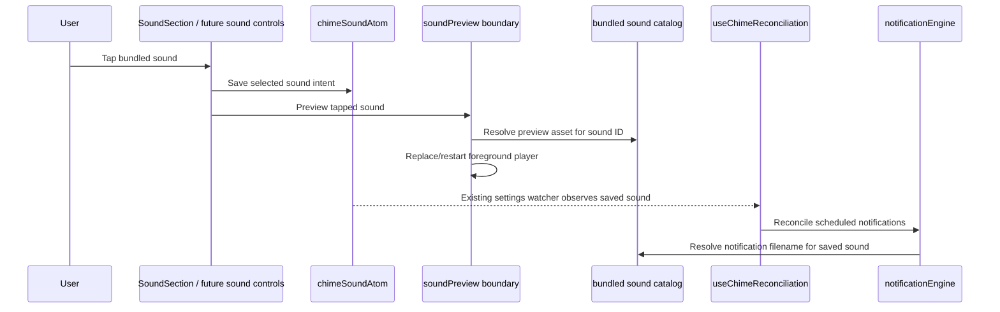

# feat: Add bundled sound previews

## Overview

Add foreground sound preview playback to Hour Beeper's bundled sound choices: when the user taps a sound option, the app should immediately attempt to play that sound while preserving the existing selection behavior. The implementation should make the sound catalog and preview playback boundary reusable for the current global sound picker and for planned per-hour custom beep controls, without adding a general audio-player surface or a speculative reusable picker component.

## Execution Status

- Completed: **Unit 1** — canonical bundled sound catalog
- Completed: **Unit 2** — foreground sound preview playback boundary
- Completed: **Unit 3** — global sound picker preview wiring
- Completed: **Unit 4** — docs and validation notes for sound preview
- Current implementation state: all 4 units complete in `f32f87e`. The remaining work is physical-device validation of preview audibility, rapid switching, and silent-switch/volume behavior.

## Problem Frame

The current sound picker changes the saved global `ChimeSound`, but users cannot hear what each bundled beep sounds like until a scheduled notification fires. That makes sound choice guesswork, and it will get worse as the sound library grows for per-hour custom beeps (see origin: `docs/brainstorms/2026-04-23-custom-per-hour-beeps-requirements.md`). The product needs a lightweight preview interaction that stays native and settings-first: tap a bundled sound, hear it, and keep using the same bundled-sound model that notification delivery already uses.

## Requirements Trace

- R1. Tapping or selecting any bundled sound option attempts foreground preview playback immediately, and implementation is not complete until real-device validation establishes the intended silent-switch/volume behavior.
- R2. The existing global sound selection semantics remain unchanged: tapping a different sound still updates `chimeSoundAtom`; tapping the currently selected sound still replays the preview.
- R3. Preview playback and notification scheduling share the same canonical bundled sound identity: every sound ID must have aligned label, notification filename, and preview asset coverage with automated drift checks.
- R4. Preview playback failures are non-blocking: a failed preview must not prevent saving the selected sound, reconciling notifications, or using the app.
- R5. The preview boundary is reusable by future per-hour custom sound controls from the origin requirements, but this plan does not implement per-hour overrides themselves.
- R6. The solution stays within the app's brief beep/chime identity and does not add recording, uploads, background playback, lock-screen controls, or a general media-player UI.

## Scope Boundaries

- No per-hour sound assignment UI or persistence in this plan; that remains the separate custom per-hour beeps feature.
- No new bundled sounds in this plan; the existing four assets are previewed, and the catalog shape should make the later 8+ sound expansion safer.
- No user-uploaded, recorded, streamed, or remote sounds.
- No background audio playback or media controls.
- No attempt to make scheduled notification delivery inherit foreground preview audio-session behavior.

### Deferred to Separate Tasks

- Expand the bundled library to at least 8 sounds: separate work under the custom per-hour beeps requirements.
- Add per-hour sound override controls: separate feature plan/work from `docs/brainstorms/2026-04-23-custom-per-hour-beeps-requirements.md`.

## Context & Research

### Relevant Code and Patterns

- `src/components/settings/SoundSection.tsx` renders the current global sound list and calls `setSound(soundId)` on press.
- `src/features/chime/types.ts` defines `CHIME_SOUND_IDS` and `ChimeSound`.
- `src/features/chime/notificationEngine.ts` has a private `SOUND_FILES` mapping from `ChimeSound` to notification sound filenames.
- `app.config.ts` lists the same sound assets for the notification-sound config plugin.
- `assets/sounds/*.wav` contains the current bundled sound files.
- `src/features/chime/notificationEngine.test.ts` already verifies that changing sound changes scheduled notification content.
- Existing tests are mostly Vitest unit tests around pure logic and adapters; UI interaction coverage may require either a small React Native testing harness or a testable extracted interaction helper.

### Institutional Learnings

- There is no `docs/solutions/` directory in this repo yet, so current local grounding comes from requirements, existing code, and prior plans.
- Notification-related plans emphasize physical-device validation for custom sound playback. This plan should keep that posture for foreground preview playback too, especially because simulator and silent-mode behavior may not represent real-device behavior.

### External References

- Expo SDK 55 `expo-audio` docs: `npx expo install expo-audio`; `useAudioPlayer(source, options)` manages player lifecycle; bundled assets can be referenced with `require(...)`; replay can seek to `0` before `play()`; `createAudioPlayer(...)` is available but requires explicit release.
- Expo SDK 55 `expo-audio` docs: background playback and lock-screen controls require additional configuration and are unnecessary for short foreground previews.

## Key Technical Decisions

- **Use `expo-audio` for foreground preview playback.** It is Expo's current audio playback API for SDK 55 and supports bundled local assets without adding deprecated `expo-av` usage.
- **Centralize sound identity before wiring preview.** A pure shared catalog should expose sound IDs, labels, ordering, and notification filenames. Expo/Metro-specific preview asset references may live in a separate preview asset map, but that map must be exhaustive over the catalog so preview and notification sounds cannot drift.
- **Prefer a lifecycle-managed preview hook with a small testable playback helper.** The UI should call a simple `previewSound(soundId)` function; the helper should handle replace/seek/play and errors, while the hook owns the Expo player lifecycle.
- **Selection and preview are both part of one tap.** The app should save the selected sound and attempt preview from the same press handler. Preview failure should be caught/logged and must not roll back selection.
- **Do not add user-visible failure UI in V1.** The selected checkmark remains the user's confirmation of the tap. A preview failure should warn for developers/QA; if validation shows reproducible silent previews, fix the playback path or silent-mode policy before shipping rather than adding a generic error surface.
- **Keep preview foreground-only and product-scoped.** Do not enable background playback, lock-screen controls, recording permissions, or media metadata for a short beep preview.

## Open Questions

### Resolved During Planning

- **Should preview apply only to the global picker or to future per-hour controls too?** The immediate UI change is the global picker, but the playback boundary and sound catalog should be reusable so per-hour controls get the same behavior without inventing a second path. A reusable picker component itself is deferred until per-hour controls exist.
- **Should tapping the already selected sound replay it?** Yes. The user asked for tapping/selecting any sound to play; replaying the current choice is useful confirmation and avoids a surprising no-op.
- **Should preview failures block selection?** No. Sound selection affects scheduled notifications and should remain usable even if foreground audio preview fails.

### Deferred to Implementation

- **Exact silent-switch behavior on iOS devices:** The intended policy is that a user-initiated foreground preview should be audible when device volume permits, while scheduled notification behavior remains unchanged. Implementation must validate whether SDK 55 `expo-audio` requires `playsInSilentMode` or other audio-session settings to satisfy that policy on real devices, then document the observed behavior.

## High-Level Technical Design

> *This illustrates the intended approach and is directional guidance for review, not implementation specification. The implementing agent should treat it as context, not code to reproduce.*

Ownership boundaries:
- The picker owns user intent: selecting a sound and requesting a preview for the tapped row.
- `chimeSoundAtom` remains the source of truth for the selected global sound and notification reconciliation.
- The bundled sound catalog owns pure metadata such as IDs, labels, order, and notification filenames; Expo/Metro-specific preview asset references should live behind the preview boundary so Node-side tests and config evaluation do not need to import `.wav` modules.
- The preview asset map must still be exhaustive over the catalog and covered by a drift test, so a user cannot preview one bundled choice while scheduled notifications resolve a different or missing sound.
- The preview boundary owns transient foreground audio state and contains playback errors.
- `notificationEngine` remains the only delivery boundary for scheduled chimes; preview playback does not become scheduling state.

Future per-hour sound controls should reuse the same catalog and preview boundary, but should reconcile notifications from their own persisted per-hour selection model when that separate feature exists. This plan does not create a reusable picker component for that future UI.

## Implementation Units

- [x] **Unit 1: Create a canonical bundled sound catalog**

**Goal:** Remove duplicated sound metadata and create one source of truth for labels, notification filenames, and sound identity, with preview asset alignment enforced by tests.

**Requirements:** R3, R5, R6

**Dependencies:** None

**Files:**
- Create: `src/features/chime/sounds.ts`
- Test: `src/features/chime/sounds.test.ts`
- Modify: `src/features/chime/types.ts`
- Modify: `src/features/chime/notificationEngine.ts`
- Modify: `src/components/settings/SoundSection.tsx`
- Modify: `app.config.ts`

**Approach:**
- Define a pure, Node-safe catalog keyed by `ChimeSound` with user-visible labels, ordering, and notification filenames for each bundled sound.
- Keep `CHIME_SOUND_IDS` as the stable domain ordering, but make label and filename lookup come from the shared catalog rather than private component/engine maps.
- Keep Expo/Metro-specific preview asset references out of the pure catalog if importing `.wav` modules would make Vitest or `app.config.ts` brittle. Static preview asset references can live in the preview boundary from Unit 2.
- Update notification request construction to use the shared notification filename lookup instead of its private `SOUND_FILES` map.
- Make native notification sound registration automatically align with catalog filenames. Prefer a pure exported notification sound path list that `app.config.ts` can import; if toolchain constraints prevent that, export the config-local list and add a test comparing its basenames to catalog notification filenames. Manual review alone is not sufficient for R3.

**Patterns to follow:**
- `src/features/chime/types.ts` for stable literal ID arrays and domain types.
- `src/features/chime/notificationEngine.ts` for existing sound filename use in notification payloads.
- `app.config.ts` plus `plugins/withNotificationSoundsOnly.ts` for native notification sound bundling.

**Test scenarios:**
- Happy path — the catalog keys exactly match `CHIME_SOUND_IDS`, with no missing or extra records.
- Happy path — display options preserve the `CHIME_SOUND_IDS` order and every entry has a non-empty label and notification filename.
- Happy path — notification requests for every sound ID use that sound's catalog notification filename.
- Edge case — the test fails if a sound ID is added without corresponding pure metadata.
- Edge case — the notification sound list used by native config remains aligned with catalog notification filenames through an automated test or shared pure list; manual review alone is not accepted.

**Verification:**
- Sound labels still render in the same order.
- Notification request payloads still contain the expected `*-beep.wav` filenames.
- The catalog is ready for later sound-library expansion without adding new parallel maps.

- [x] **Unit 2: Add the foreground sound preview playback boundary**

**Goal:** Provide a small, reusable API for playing a bundled sound preview from app UI code.

**Requirements:** R1, R4, R5, R6

**Dependencies:** Unit 1

**Files:**
- Modify: `package.json`
- Modify: `bun.lock`
- Create: `src/features/chime/soundPreview.ts`
- Create: `src/features/chime/soundPreviewAssets.ts`
- Create: `src/features/chime/useSoundPreview.ts`
- Create: `assets.d.ts`
- Test: `src/features/chime/soundPreview.test.ts`

**Approach:**
- Add `expo-audio` with the Expo-compatible installer/version for SDK 55.
- Add a pre-implementation checkpoint: verify the app's Expo SDK version and confirm `expo-audio` can play one bundled `.wav` in the target dev-client/device environment. If that check fails, stop before UI wiring and reassess the playback dependency rather than papering over the failure.
- Define the preview boundary contract before wiring UI: it accepts only `ChimeSound`, starts the chosen sound from the beginning on every call, prevents overlapping previews under rapid taps, and resolves without throwing for expected playback failures.
- Split testable behavior from platform bindings: put rapid-tap/restart/error behavior in a pure controller/helper that accepts an injected player adapter and source resolver; keep `expo-audio` and static `require(...)` calls in a React Native hook/module not imported by Vitest.
- Expose a UI-facing preview function/hook that plays the tapped sound's explicit static preview asset reference.
- Use Expo audio playback for short foreground sounds only. Do not configure background playback, lock-screen controls, recording permissions, or media metadata.
- For repeated taps, restart playback from the beginning so the same sound can be auditioned repeatedly.
- For rapid taps across different sounds, prefer a single active preview player that replaces/stops/restarts rather than layering multiple overlapping beeps; the later tap should be considered the active preview intent.
- Catch playback errors inside the preview boundary and surface them as warnings or a lightweight error callback; do not throw through the sound selection UI.
- Test app-owned preview behavior with a fake player/adapter rather than real Expo audio or real `.wav` playback.

**Execution note:** Add playback-boundary tests before wiring UI so the press handler can stay simple and failure-tolerant.

**Patterns to follow:**
- `src/features/chime/notificationEngine.ts` adapter style: isolate Expo module interaction behind a small app-owned boundary and make failures contained.
- Expo SDK 55 `expo-audio` docs for bundled assets, replay via seek-to-zero, and lifecycle-managed players.

**Test scenarios:**
- Happy path — previewing `casio` resolves the expected preview source token and invokes restart/play behavior on a fake player.
- Happy path — previewing a second sound replaces or stops the current active preview before playing the new one.
- Happy path — the preview asset map is exhaustive over `CHIME_SOUND_IDS` / catalog keys and has no extras.
- Edge case — tapping the same sound repeatedly restarts that sound rather than doing nothing.
- Edge case — two close-together preview calls leave the later sound as the active preview intent rather than layering both indefinitely.
- Edge case — an unknown or invalid sound cannot be passed through the typed public API; sanitizer/catalog tests protect persisted values separately.
- Error path — load/replace/seek/play failure is caught and reported without rejecting to the caller that saves selection.

**Verification:**
- App code can call one preview API from any sound selector.
- Preview behavior is deterministic for repeated and rapid taps.
- Preview failures do not break the app's settings state.
- Dependency/config review confirms no notification permission, recording permission, background audio, or media-control configuration was introduced for preview.
- The pre-implementation dependency checkpoint either validates `expo-audio` for one bundled `.wav` on target hardware or stops the work before UI wiring.

- [x] **Unit 3: Wire preview into the global sound picker**

**Goal:** Make every tap in the existing sound picker save the selected sound and play its preview, while keeping the reusable commitment at the catalog and preview-boundary level.

**Requirements:** R1, R2, R5

**Dependencies:** Units 1 and 2

**Files:**
- Modify: `src/components/settings/SoundSection.tsx`
- Create: `src/components/settings/soundSelectionModel.ts` if a pure press-handler seam keeps tests Vitest-friendly
- Test: `src/components/settings/soundSelectionModel.test.ts`

**Approach:**
- Update the press handler so it writes the selected sound and invokes the preview boundary for the tapped sound.
- Make selection independent of preview success. Prefer saving the selected sound before attempting preview, or otherwise structure the handler so a preview rejection cannot prevent the setter from running.
- Preserve the existing checkmark and ordering behavior.
- Ensure tapping the currently selected row invokes preview even if the atom value does not change.
- Bias toward a small pure press-handler/model seam for Vitest coverage instead of introducing React Native component-test tooling solely for this feature.
- Do not extract a reusable `SoundOptionList` in this plan unless implementation reveals an immediate second consumer. The reusable commitment here is the catalog plus preview boundary, not a speculative picker API.

**Patterns to follow:**
- `src/components/settings/ScheduleSection.tsx` and `src/components/settings/SoundSection.tsx` for simple Pressable list/grid controls.
- `src/features/chime/atoms.ts` for atom-backed settings updates.

**Test scenarios:**
- Happy path — pressing an unselected sound calls the setter with that sound and calls preview with the same sound ID.
- Happy path — pressing the currently selected sound still calls preview and does not branch into a no-op.
- Happy path/accessibility — sound rows expose a button-like interaction with label, selected state, and a hint that activation selects and plays a preview.
- Edge case — a preview failure/rejection does not prevent the setter from being called.
- Edge case — the handler does not introduce a same-value guard that skips replay.
- Edge case/accessibility — audio is not the only confirmation of activation; selected state/checkmark remains visible and exposed to assistive technologies.
- Integration — changing the selected sound still flows through existing reconciliation, causing notification requests to update via the existing settings watcher.

**Verification:**
- In the app, every visible global sound row plays its preview when tapped.
- The selected checkmark still reflects persisted global sound state.
- Future per-hour controls can reuse the catalog and preview boundary without this plan committing to their picker component shape.

- [x] **Unit 4: Update docs and validation notes for sound preview**

**Goal:** Document the new foreground preview behavior and make real-device validation explicit.

**Requirements:** R4, R6

**Dependencies:** Units 1-3

**Files:**
- Modify: `README.md`
- Modify: `docs/plans/2026-04-29-001-feat-sound-preview-plan.md` only if implementation discovers a planning assumption that should be corrected before handoff

**Approach:**
- Update user-facing or developer docs that describe bundled sound behavior so they mention tap-to-preview where appropriate.
- Keep wording narrow: preview is foreground UI feedback, not a change to scheduled notification delivery or silent-mode guarantees.
- Add validation notes for physical-device checks: audible preview for each bundled sound, repeated same-sound tap, rapid switching, and behavior with the device silent switch/volume settings observed rather than assumed.

**Patterns to follow:**
- README's existing concise product/development notes.
- Prior notification plans' posture that device validation is required for sound behavior.

**Test scenarios:**
- Test expectation: none -- documentation and manual validation checklist only; behavioral coverage belongs to Units 1-3.

**Verification:**
- Docs accurately describe preview behavior without overstating notification or silent-mode behavior.
- The implementation handoff includes clear physical-device checks.

## System-Wide Impact

- **Interaction graph:** `SoundSection` / future sound pickers call the preview boundary and update Jotai settings; persisted settings still flow through `useChimeReconciliation`; `notificationEngine` continues to schedule notification payloads from the selected sound; `expo-audio` handles foreground UI preview only.
- **Error propagation:** Preview errors should be contained at the preview boundary. Selection and notification reconciliation should continue normally.
- **State lifecycle risks:** Rapid taps can otherwise layer multiple sounds or leave player state stale; a single replace/restart preview path mitigates that. Persisted sound state should remain the source of truth for scheduled chimes.
- **API surface parity:** The global picker and future per-hour controls should use the same sound catalog and preview API. Notification sound filenames and preview assets must stay aligned for every `ChimeSound` through automated checks.
- **Integration coverage:** Unit tests should prove catalog/notification alignment and preview press behavior; physical-device validation should prove audible playback for bundled `.wav` files.
- **Unchanged invariants:** Schedule models, notification permission flow, notification delivery semantics, native notification sound bundling, and the notification-only delivery path remain unchanged.

## Risks & Dependencies

| Risk | Mitigation |
|------|------------|
| `expo-audio` bundled asset behavior differs between simulator, dev client, and release builds. | Use explicit static asset references, keep the implementation on SDK 55's documented API, and validate on a physical device/build. |
| Sound catalog centralization accidentally breaks notification sound filenames. | Add catalog alignment tests and keep notification-engine tests asserting payload filenames. |
| Preview playback errors make sound selection feel broken. | Catch preview errors and allow selection/persistence/reconciliation to proceed. |
| Rapid tapping causes overlapping previews or stale playback. | Use a single replace/restart preview path rather than creating a new uncontrolled player per tap. |
| Silent-mode behavior surprises users. | Treat real-device silent-switch validation as an acceptance gate; choose/document the audio-session policy before considering the feature complete. |
| `expo-audio` cannot play bundled `.wav` reliably in the target dev/release environment. | Run the dependency checkpoint before UI wiring; if it fails, stop and reassess the playback dependency or asset strategy. |
| Adding component-test tooling creates more churn than the feature warrants. | Prefer a small extracted model/helper if React Native component testing is not already easy in the repo. |

## Documentation / Operational Notes

- This feature adds an app foreground audio dependency, not a notification-delivery dependency.
- Automated tests should stay focused on pure catalog alignment, notification filename usage, preview helper behavior with fakes, and sound-selection press semantics.
- Static/config review should confirm dependency addition, automated native notification sound list alignment, and absence of background audio / recording / media-control configuration.
- Device validation should include each bundled `.wav`, tapping the same selected sound twice, quick switching across sounds, and observing silent switch / volume behavior.
- No migration is required because persisted settings remain the same.

## Sources & References

- **Origin document:** [docs/brainstorms/2026-04-23-custom-per-hour-beeps-requirements.md](docs/brainstorms/2026-04-23-custom-per-hour-beeps-requirements.md)
- Related code: `src/components/settings/SoundSection.tsx`
- Related code: `src/features/chime/types.ts`
- Related code: `src/features/chime/notificationEngine.ts`
- Related code: `app.config.ts`
- Related assets: `assets/sounds/`
- External docs: https://docs.expo.dev/versions/v55.0.0/sdk/audio/
