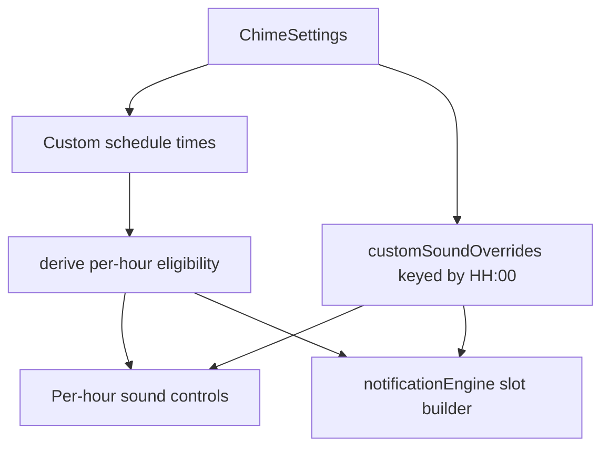

# feat: Add custom per-hour beeps

## Overview

Add optional per-hour sound overrides for sparse custom schedules. Preset schedules continue using one global sound. Custom schedules with 1-5 selected hours can use the global sound by default and override individual selected hours. Custom schedules with 6+ selected hours fall back to the global sound while preserving saved override assignments for later. The work also expands the bundled sound library from 4 to at least 8 short watch-like sounds so per-hour choice is worth having.

This plan builds on the current notification-only app, the repeater-per-slot scheduling model, and the sound-preview branch's canonical sound catalog / preview boundary.

## Problem Frame

Hour Beeper currently has two relevant pieces: a global bundled sound picker and a custom-hour schedule picker. That makes sparse schedules useful but not expressive: a user who wants a few intentional daily chimes cannot distinguish them by sound. The new behavior should make sparse custom schedules richer without turning the app into a reminder composer, alarm builder, or dense matrix editor (see origin: `docs/brainstorms/2026-04-23-custom-per-hour-beeps-requirements.md`).

The main technical challenge is preserving dormant hour-to-sound assignments. Overrides must stop applying when a schedule becomes ineligible, but they must not be deleted when the user selects too many hours, switches to a preset, removes an hour, or later re-adds that hour.

## Requirements Trace

- **R1-R2** — per-hour selection is available only for custom schedules with 5 or fewer selected hours.
- **R3-R5** — preset schedules and default custom behavior continue using the global sound; overrides are optional and reusable.
- **R6-R10** — overrides become inactive when ineligible or empty, but saved assignments survive and reactivate predictably.
- **R11-R12** — the bundled library grows to at least 8 brief beep/chime sounds that still fit the product identity.
- **R13-R14** — the UI explains the 5-hour cap and keeps disabled/read-only override state visible for 6+ selected hours.

## Scope Boundaries

- No custom message entry.
- No user-uploaded, recorded, streamed, or remote sounds.
- No per-slot custom sounds for preset schedules.
- No minute-level custom sound assignment; custom override keys remain hour / `HH:00` based for this pass.
- No requirement that every selected custom hour has an explicit override; the global sound remains the default.
- No broader redesign of scheduling, notification permissions, or diagnostics beyond what is needed to keep this feature understandable.

### Deferred to Separate Tasks

- Android-specific notification-channel behavior once Android support exists.
- iCloud / cross-device sync of settings.
- A richer diagnostics dashboard for raw pending notification identifiers and trigger metadata.

## Context & Research

### Relevant Code and Patterns

- `src/features/chime/types.ts` owns `ChimeSettings`, `ChimeSchedule`, `ChimeSound`, and the ordered `CHIME_SOUND_IDS` domain list.
- `src/features/chime/schedule.ts` is the persisted-settings sanitization and migration choke point. It currently drops empty custom schedules and only preserves the global `sound`.
- `src/features/chime/atoms.ts` exposes focused Jotai write atoms for settings updates.
- `src/features/chime/sounds.ts` is now the canonical catalog for labels and notification filenames.
- `src/features/chime/soundPreview.ts`, `src/features/chime/soundPreviewAssets.ts`, `src/features/chime/useSoundPreview.ts`, and `src/components/settings/soundSelectionModel.ts` provide reusable foreground preview behavior that per-hour controls should reuse.
- `src/components/settings/ScheduleSection.tsx` owns the custom-hour grid and currently prevents deselecting the last hour.
- `src/components/settings/SoundSection.tsx` owns the global default sound picker.
- `src/features/chime/notificationEngine.ts` builds one repeating notification request per logical slot and currently applies `settings.sound` to every request.
- `app.config.ts` registers notification sound assets from `NOTIFICATION_SOUND_PATHS`, so catalog changes should flow into native sound bundling.
- Current regression surfaces: `src/features/chime/schedule.test.ts`, `src/features/chime/notificationEngine.test.ts`, `src/features/chime/sounds.test.ts`, `src/features/chime/soundPreview.test.ts`, `src/components/settings/soundSelectionModel.test.ts`, and new focused tests for per-hour UI/model helpers.

### Institutional Learnings

- There is no `docs/solutions/` directory in this repo yet. Existing local plans emphasize stable slot identities, destructive reconciliation on plan mismatch, and physical-device validation for notification sounds.
- Repeater identifiers are logical slot based, so per-hour sound changes should update request content/fingerprints while keeping request identity stable.

### External References

- No external research is required for the implementation shape. The app already has the relevant Expo notification and audio boundaries in place.
- Additional sound assets should be generated or otherwise sourced with clear provenance. Generated short PCM tones are preferred for this pass to avoid licensing ambiguity.

## Key Technical Decisions

- **Store overrides top-level in `ChimeSettings`, not inside `ChimeSchedule`.** A top-level `customSoundOverrides` record keyed by `HH:00` survives switching to presets, removing hours, and temporarily selecting 6+ custom hours.
- **Use slot keys as override keys.** Keys like `09:00` match notification slot identity and leave a clean upgrade path for future minute-level custom schedules without changing the persistence concept.
- **Allow empty custom schedules as a real state.** The origin explicitly defines custom schedules with 0 selected hours. Empty custom schedules should schedule no notifications and activate no overrides instead of silently falling back to hourly.
- **Derive active override behavior, do not mutate overrides on eligibility changes.** Eligibility is computed from the current schedule shape and selected-hour count. Saved override records remain dormant until eligible again.
- **Keep the global sound picker as the default sound.** Per-hour UI should present overrides as exceptions to the default, not as a replacement for the existing sound model.
- **Reuse the sound catalog and preview boundary.** Per-hour controls should preview sounds through the same path as the global picker so expanded sounds cannot drift between preview and notification delivery.
- **Generate or explicitly document new short bundled sounds.** Added sounds should be brief, watch-like beeps/chimes and validated in both foreground preview and scheduled notification delivery.

## Open Questions

### Resolved During Planning

- **Where should dormant overrides live?** Top-level `ChimeSettings.customSoundOverrides`, keyed by `HH:00`, so they survive schedule changes.
- **Should zero selected custom hours be representable?** Yes. It is part of the origin behavior summary and should produce zero notification requests.
- **How should 6+ selected custom hours behave?** Use the global sound for every scheduled slot, keep saved assignments read-only/disabled in the UI, and reactivate them when the selected-hour count returns to 5 or fewer.
- **How should the sound library expand?** Add at least 4 more short bundled beeps/chimes through generated or clearly sourced `.wav` files, then wire them through the canonical catalog, notification filenames, preview assets, docs, and tests.

### Deferred to Implementation

- **Exact names and wave shapes for the added sounds:** Implementation should choose concise labels after listening on a physical device, while staying within the watch-like identity.
- **Exact UI layout density:** The plan defines the model and states; implementation can choose the simplest row/picker/pill layout that stays readable on-device.
- **Exact React Native test harness depth:** Use pure extracted model tests where possible; only add component tests if the existing setup supports them without disproportionate scaffolding.

## High-Level Technical Design

> *This illustrates the intended approach and is directional guidance for review, not implementation specification. The implementing agent should treat it as context, not code to reproduce.*

| Current schedule | Selected hours | Saved override for selected slot? | Active sound used for scheduling | UI state |
| --- | ---: | --- | --- | --- |
| Preset | n/a | ignored | global sound | per-hour controls hidden |
| Custom | 0 | ignored | no requests | controls explain no hours selected |
| Custom | 1-5 | no | global sound | editable per-hour rows show default |
| Custom | 1-5 | yes | override sound | editable per-hour rows show override |
| Custom | 6+ | yes/no | global sound | read-only disabled override rows / cap explanation |

Suggested data flow:

## Implementation Units

- [ ] **Unit 1: Expand the bundled sound catalog to 8+ sounds**

**Goal:** Add enough short, watch-like bundled sounds for per-hour customization to feel meaningful, while preserving one canonical catalog for labels, notification filenames, preview assets, and native bundling.

**Requirements:** R11, R12

**Dependencies:** None

**Files:**
- Create/Modify: `assets/sounds/*.wav`
- Modify: `src/features/chime/types.ts`
- Modify: `src/features/chime/sounds.ts`
- Modify: `src/features/chime/soundPreviewAssets.ts`
- Modify: `README.md`
- Test: `src/features/chime/sounds.test.ts`
- Test: `src/features/chime/soundPreview.test.ts`

**Approach:**
- Add at least four additional bundled `.wav` assets with clear provenance. Prefer generated simple tones/chimes over externally sourced sounds unless licensing is explicit.
- Extend `CHIME_SOUND_IDS` and `CHIME_SOUND_CATALOG` so every sound has an ID, label, and notification filename.
- Extend `soundPreviewAssets.ts` with explicit static asset imports for every catalog sound.
- Keep `NOTIFICATION_SOUND_PATHS` derived from the catalog so `app.config.ts` continues registering every notification sound.
- Avoid novelty/alarm sounds; favor short, low-friction beeps with modest differences in pitch/timbre/rhythm.

**Execution note:** Add/adjust catalog drift tests before relying on the expanded list in UI or notification code.

**Patterns to follow:**
- `src/features/chime/sounds.ts`
- `src/features/chime/soundPreviewAssets.ts`
- `app.config.ts`

**Test scenarios:**
- Happy path — catalog keys exactly match `CHIME_SOUND_IDS` and contain at least 8 entries.
- Happy path — every catalog entry has a non-empty label and `.wav` notification filename.
- Happy path — preview source coverage is exhaustive over every `ChimeSound`.
- Edge case — legacy persisted sound IDs like `digital` and `soft` still sanitize to current IDs.

**Verification:**
- The global sound picker shows 8+ choices.
- Notification sound paths and preview assets stay aligned with the catalog.
- No new background audio, recording, or media-control configuration is introduced.

- [ ] **Unit 2: Add persisted dormant custom-hour sound overrides**

**Goal:** Extend settings persistence so hour-to-sound assignments can be saved independently from current schedule eligibility.

**Requirements:** R1-R10

**Dependencies:** Unit 1 for final sound ID set, but model work can begin with existing IDs.

**Files:**
- Modify: `src/features/chime/types.ts`
- Modify: `src/features/chime/schedule.ts`
- Modify: `src/features/chime/atoms.ts`
- Modify: `src/storage/persist.ts` if the persisted atom shape needs migration notes or defaults
- Test: `src/features/chime/schedule.test.ts`

**Approach:**
- Add a top-level `customSoundOverrides` field to `ChimeSettings`, keyed by slot keys such as `09:00` and valued by `ChimeSound`.
- Add pure helpers for slot-key creation, selected custom-hour slot keys, eligibility checks, active override lookup, and safe override updates.
- Sanitize persisted override records by keeping only valid `HH:00` keys and valid sound IDs.
- Preserve override records even when the current schedule is preset, empty custom, or custom with 6+ selected hours.
- Change custom schedule sanitization and `createCustomHoursSchedule([])` so an empty custom schedule remains custom with no times rather than falling back to the hourly preset.

**Execution note:** Implement persistence/sanitization behavior test-first; this is the main data-loss risk in the feature.

**Patterns to follow:**
- `src/features/chime/schedule.ts`
- `src/features/chime/schedule.test.ts`
- `src/features/chime/atoms.ts`

**Test scenarios:**
- Happy path — valid persisted override records survive sanitization.
- Happy path — switching to a preset preserves `customSoundOverrides` while preset behavior remains global-sound only.
- Happy path — removing a selected custom hour preserves that hour's saved override record.
- Happy path — re-adding a removed hour makes its saved override eligible again when selected-hour count is 5 or fewer.
- Edge case — custom schedules with zero selected hours sanitize as `{ kind: "custom", times: [] }` and have no active overrides.
- Edge case — custom schedules with 6 selected hours preserve overrides but report no active override sounds.
- Edge case — invalid override keys, invalid minutes, invalid hours, and invalid sound IDs are dropped.
- Migration — old settings without `customSoundOverrides` load with an empty override record.

**Verification:**
- Settings can represent every behavior row from the origin document without deleting dormant assignments.
- Existing global schedule and sound settings continue sanitizing correctly.

- [ ] **Unit 3: Apply per-hour sounds when building notification repeaters**

**Goal:** Make scheduled notification content use an active per-hour override only for eligible custom schedules, while preserving stable slot identifiers and global-sound behavior everywhere else.

**Requirements:** R1-R10

**Dependencies:** Unit 2

**Files:**
- Modify: `src/features/chime/notificationEngine.ts`
- Test: `src/features/chime/notificationEngine.test.ts`

**Approach:**
- Teach notification request building to resolve a sound per slot instead of always using `settings.sound`.
- For preset schedules, use the global sound for every slot.
- For custom schedules with 0 selected hours, build no requests.
- For custom schedules with 1-5 selected hours, use the saved override for a slot when present; otherwise use the global sound.
- For custom schedules with 6+ selected hours, ignore overrides and use the global sound for every slot.
- Keep identifiers based on logical slot and trigger type only; changing an override should change payload/fingerprint and trigger a reschedule without changing slot identity.

**Execution note:** Start with request-builder assertions before reconciliation tests.

**Patterns to follow:**
- `src/features/chime/notificationEngine.ts`
- Existing sound-change tests in `src/features/chime/notificationEngine.test.ts`

**Test scenarios:**
- Happy path — eligible custom schedule `[09, 17]` with an override only for `17:00` schedules `09:00` with the global sound and `17:00` with the override sound.
- Happy path — changing a per-hour override changes notification content and fingerprint while preserving identifiers.
- Happy path — preset schedules ignore saved custom overrides and use the global sound.
- Edge case — custom schedules with zero hours schedule zero requests.
- Edge case — custom schedules with 6+ hours preserve request count but use only the global sound.
- Integration — reconciliation cancels/reschedules stale app-owned requests when an active per-hour override changes, but returns `unchanged` when the pending plan already matches.

**Verification:**
- Notification payload `content.sound` and `content.data.sound` reflect the effective slot sound.
- Repeater identity remains stable across sound changes.

- [ ] **Unit 4: Build the per-hour sound settings UI**

**Goal:** Let users view and edit per-hour overrides only in eligible custom schedules, with clear cap communication and read-only dormant state for ineligible custom schedules.

**Requirements:** R1-R5, R10, R13, R14

**Dependencies:** Units 1-3

**Files:**
- Modify: `src/components/settings/ScheduleSection.tsx`
- Create: `src/components/settings/PerHourSoundSection.tsx` or equivalent focused component
- Create/Modify: `src/components/settings/perHourSoundModel.ts`
- Modify: `src/screens/HomeScreen.tsx` if the new controls sit outside `ScheduleSection`
- Test: `src/components/settings/perHourSoundModel.test.ts`

**Approach:**
- Keep the existing global sound picker as the default sound selector.
- Allow users to deselect the last custom hour so zero-hour custom schedules are representable.
- Show per-hour controls only when the schedule is currently custom.
- For 1-5 selected hours, show one compact row per selected hour with its effective sound: default/global unless an override exists.
- Let the user set, change, or clear an override for each selected hour. Clearing returns that hour to the global default.
- Reuse the existing sound preview boundary when a per-hour sound option is selected.
- For 6+ selected hours, keep the section visible but disabled/read-only, explain the 5-hour cap, and show saved assignments for currently selected hours where they exist.
- For 0 selected hours, show a lightweight empty state explaining that per-hour sounds appear after choosing up to 5 hours.

**Execution note:** Extract pure UI state/label/update helpers before component wiring so eligibility and dormant-state behavior can be tested without a full React Native test harness.

**Patterns to follow:**
- `src/components/settings/ScheduleSection.tsx`
- `src/components/settings/SoundSection.tsx`
- `src/components/settings/soundSelectionModel.ts`
- `src/features/chime/useSoundPreview.ts`

**Test scenarios:**
- Happy path — eligible custom schedule renders editable rows for each selected hour with default/global labels when no override exists.
- Happy path — selecting an override writes the correct `HH:00 -> sound` record and previews that sound.
- Happy path — clearing an override removes only that hour's override record and leaves other hours intact.
- Happy path — tapping an already selected per-hour sound previews it again.
- Edge case — zero selected hours returns the empty-state model and no active override rows.
- Edge case — 6+ selected hours returns a disabled/read-only model and preserves visible saved assignments where present.
- Edge case — switching between preset and custom hides/shows per-hour controls without clearing saved overrides.
- Failure path — preview failure does not prevent the override assignment from being saved.

**Verification:**
- The settings screen communicates the 5-hour cap clearly.
- A user can move between eligible and ineligible states without losing assignments.
- The UI still feels like a compact settings surface, not a general reminder editor.

- [ ] **Unit 5: Update docs, TODOs, and validation guidance**

**Goal:** Keep product/developer docs aligned with the new per-hour behavior and physical-device validation needs.

**Requirements:** R11-R14 and all success criteria

**Dependencies:** Units 1-4

**Files:**
- Modify: `README.md`
- Modify: `TODO.md`
- Modify: `docs/plans/2026-04-29-002-feat-custom-per-hour-beeps-plan.md` only if implementation discovers a planning assumption that should be corrected

**Approach:**
- Document the expanded bundled sound library and the distinction between global default sound and per-hour overrides.
- Make clear that per-hour sounds are custom-schedule-only and capped at 5 selected hours.
- Add validation notes for scheduled notification delivery for each new sound, foreground preview playback, and eligible/ineligible override transitions.
- Remove or close TODO entries that this feature completes.

**Patterns to follow:**
- Current README delivery/sounds/diagnostics sections.
- Existing TODO validation matrix style.

**Test scenarios:**
- Test expectation: none — documentation-only unit. Product behavior is covered by Units 1-4 tests.

**Verification:**
- Docs match the implemented behavior and do not mention custom messages.
- Validation notes cover both foreground previews and scheduled notification delivery for the expanded sounds.

## System-Wide Impact

- **Interaction graph:** `ScheduleSection` / per-hour controls update persisted settings; `useChimeReconciliation` observes settings changes; `notificationEngine` reschedules repeaters when effective slot sounds change; preview remains foreground-only UI feedback.
- **Error propagation:** Invalid persisted overrides are dropped during sanitization. Preview failures stay contained at the preview boundary and must not block settings updates.
- **State lifecycle risks:** The main risk is accidental data loss from deleting dormant overrides during schedule changes. Top-level override storage and sanitizer tests mitigate this.
- **API surface parity:** Global picker and per-hour controls should use the same sound catalog and preview path. Notification filenames and preview assets must remain exhaustive over `CHIME_SOUND_IDS`.
- **Integration coverage:** Unit tests should cover sanitization, active sound derivation, notification payloads, and UI model transitions. Physical-device validation must cover the new assets in scheduled notifications.
- **Unchanged invariants:** Preset schedules, global default sound behavior, notification-only delivery, and stable repeater identifiers remain unchanged.

## Risks & Dependencies

| Risk | Mitigation |
| --- | --- |
| Dormant overrides are accidentally deleted when schedule changes. | Store overrides top-level and test schedule transitions explicitly. |
| The UI becomes too dense with 8+ sounds and per-hour rows. | Keep global sound as default, show only selected-hour rows, and defer reusable picker abstraction until needed. |
| New sounds work in preview but not as scheduled notification sounds. | Register all assets through the catalog-derived notification paths and require physical-device notification validation. |
| Added sound assets have unclear licensing/provenance. | Prefer generated tones/chimes or document source/provenance clearly. |
| Empty custom schedules break assumptions that custom always has at least one time. | Update schedule, notification, UI, and tests together so zero custom hours is an explicit supported state. |

## Documentation / Operational Notes

- Physical-device validation should cover each new sound in foreground preview and scheduled notification delivery.
- Dogfooding should include transitions from 5 selected hours to 6+ and back, removing/re-adding a previously overridden hour, and switching preset/custom without losing dormant overrides.
- If the implementation generates new sound assets, keep the generation recipe or provenance note discoverable for future sound-library changes.

## Sources & References

- **Origin document:** [docs/brainstorms/2026-04-23-custom-per-hour-beeps-requirements.md](../brainstorms/2026-04-23-custom-per-hour-beeps-requirements.md)
- Related plan: [docs/plans/2026-04-29-001-feat-sound-preview-plan.md](2026-04-29-001-feat-sound-preview-plan.md)
- Related code: `src/features/chime/schedule.ts`
- Related code: `src/features/chime/notificationEngine.ts`
- Related code: `src/features/chime/sounds.ts`
- Related UI: `src/components/settings/ScheduleSection.tsx`
- Related UI: `src/components/settings/SoundSection.tsx`
