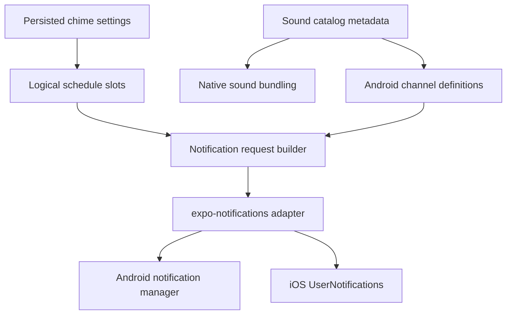

# feat: Enable Android platform support

## Overview

Enable Android as a supported platform for Hour Bell without changing the product from a focused notification-only hourly chime app. The work adds Android app identity/configuration, Android-aware notification sound packaging, runtime notification channels, permission and blocked-state handling, build/run scripts, documentation, and a physical-device validation matrix.

This is not a Play Store submission plan. Production Android build configuration is in scope so the app can produce Android artifacts through EAS, but Play Console setup, EAS submit, store listing work, and review operations are deferred.

## Problem Frame

The original app intentionally shipped iOS-first and treated Android as out of scope while preserving a path for future support (see origin: `docs/brainstorms/2026-04-16-hourly-chime-app-requirements.md`). The current codebase has now converged on notification-only chimes, which is the correct cross-platform delivery model to extend. Android support is blocked by iOS-shaped native config, iOS-only notification sound copying, missing Android notification channels, missing Android scripts, and unvalidated Android notification behavior.

The main technical risk is that Android local notification sound behavior is channel-based on Android 8+. A selected chime sound cannot be modeled only as `content.sound`; the runtime must schedule through a channel whose sound was configured before the notification fires.

## Requirements Trace

- **R1 — Android app identity:** development, staging, and production variants must have unique Android package names and app metadata while preserving the existing iOS identifiers.
- **R2 — Android local notification delivery:** enabled chimes should schedule Android local notifications from the same persisted settings and logical slot model used on iOS.
- **R3 — Custom bundled sounds:** scheduled Android notifications should use the selected bundled chime sound where the platform supports it.
- **R4 — Shared product model:** Android must reuse the current notification-only schedule, sound, persistence, diagnostics, and settings concepts rather than reintroducing delivery modes.
- **R5 — Permission and blocked-state UX:** Android notification permission/global notification/channel-disabled states should be reflected in permission banners or diagnostics so users know why chimes are blocked.
- **R6 — Build/run workflows:** the repo should expose Android dev, staging, and production EAS build paths plus local device run/install helpers.
- **R7 — Validation:** Android support must include physical-device validation for permission prompts, scheduled delivery, custom sounds, app states, reboot/relaunch, clock changes, and notification tray behavior.
- **R8 — Submission boundary:** Play Store submission and EAS Android submit configuration are explicitly deferred.

## Scope Boundaries

- No Play Console, Google service account, EAS submit, store metadata, or release review setup in this plan.
- No Android push notification service work; Hour Bell uses locally scheduled notifications.
- No revival of AlarmKit or a delivery-mode abstraction.
- No promise of exact delivery under Android Doze, OEM battery restrictions, DND, silent mode, or user-mutated notification channels until physical-device validation supports that claim.
- No broad redesign of the settings UI beyond Android-specific blocked-state copy/diagnostics required for support.

### Deferred to Separate Tasks

- Play Store / EAS submit setup: separate release-management task after Android artifacts are validated.
- Cross-device sync: future product/platform task.
- Exact-alarm or native Android scheduling fallback: future task only if validation shows Expo repeating notifications cannot meet the product tolerance.
- Expanded Android QA automation: future task after manual device validation defines stable expectations.

## Context & Research

### Relevant Code and Patterns

- `app.config.ts` is the central variant config, but currently only models `ios.bundleIdentifier` and `ios.icon`.
- `eas.json` has shared build profiles and iOS submit config. Build profiles already carry `APP_VARIANT`, but Android-specific emulator/internal settings and submit config are absent.
- `scripts/build.ts` already accepts `ios | android`; `package.json` only exposes iOS scripts.
- `plugins/withNotificationSoundsOnly.ts` copies notification sounds into the iOS project only.
- `plugins/withLocalNotificationsOnly.ts` removes iOS push entitlements and should remain iOS-only.
- `plugins/withXcodeEnv.ts` is an iOS-only local build helper and should not affect Android.
- `src/features/chime/sounds.ts` is the canonical sound catalog and currently exposes iOS-style notification filenames such as `bellio_beep.wav`.
- `src/features/chime/notificationEngine.ts` owns request building, reconciliation, ownership filtering, foreground behavior, and the Expo notifications adapter.
- `src/features/chime/permissions.ts` normalizes permission responses into the app's current `unknown | granted | denied | unavailable` style.
- `src/hooks/useChimeReconciliation.ts` is the bridge from persisted settings to scheduled notification artifacts.
- Existing test patterns live in `src/features/chime/notificationEngine.test.ts`, `src/features/chime/sounds.test.ts`, `src/features/chime/schedule.test.ts`, `src/features/chime/diagnostics.test.ts`, and UI model tests under `src/components/settings/`.
- `README.md` currently says the app is iOS-first and has Android listed as a planned follow-up.

### Institutional Learnings

- Notification-only is the current product direction; Android should extend that model rather than restore the old AlarmKit-vs-notifications comparison (`docs/plans/2026-04-23-001-refactor-remove-alarmkit-plan.md`).
- Repeating notification artifacts are derived state: canonical settings materialize logical schedule slots, then reconciliation owns cancellation/rescheduling (`docs/plans/2026-04-23-001-fix-repeating-notification-scheduling-plan.md`).
- Notification cleanup is best-effort, not a correctness mechanism; Android tray cleanup should be documented honestly and validated separately (`docs/plans/2026-04-17-001-fix-post-fire-notification-cleanup-plan.md`, `docs/plans/2026-04-17-002-fix-grouped-notification-cleanup-plan.md`).
- Bundled sounds are core product behavior; foreground preview and scheduled notification delivery must stay distinct and both require physical-device validation (`docs/plans/2026-04-29-001-feat-sound-preview-plan.md`, `docs/plans/2026-04-29-002-feat-custom-per-hour-beeps-plan.md`).
- Android notification-channel behavior was previously deferred until Android support existed (`docs/plans/2026-04-29-002-feat-custom-per-hour-beeps-plan.md`).

### External References

- Expo Notifications docs: the `expo-notifications` config plugin can bundle custom sounds, configure Android notification icon/color/default channel, and requires base filenames at runtime.
- Expo Notifications docs: Android 8+ custom notification sounds require a `NotificationChannel` with the sound configured, plus scheduled notifications using the matching `channelId`; `content.sound` alone is not sufficient.
- Expo Notifications Android plugin source: sound files are copied into `android/app/src/main/res/raw`, and Android raw resource names must be valid resource identifiers.
- Android notification permission docs: Android 13+ requires runtime `POST_NOTIFICATIONS` permission for non-exempt notifications.
- Expo SDK 55 changelog: `expo-notifications` changed Android notification behavior and validates custom sound existence more strictly, increasing the value of catalog/resource drift tests.

## Key Technical Decisions

- **Use notification-only Android parity:** Android plugs into the existing schedule/settings/reconciliation model instead of adding platform delivery modes.
- **Adopt Expo Notifications config plugin for native notification assets:** Replace or supplement the local iOS-only sound plugin with the official `expo-notifications` plugin so notification sounds and Android notification icon/color resources are handled by EAS/prebuild.
- **Make sound metadata platform-aware:** Extend `src/features/chime/sounds.ts` with stable Android raw resource names and Android channel IDs, rather than deriving Android behavior from iOS filenames ad hoc.
- **Prefer one channel per effective chime sound:** Android channels are sound-bearing and user-owned after creation, so each bundled sound needs its own stable channel. Scheduled requests choose the channel that matches the effective slot sound.
- **Keep channel creation idempotent and early:** Android channels should be ensured before scheduling, at app runtime initialization and/or reconciliation, so scheduled notifications never reference missing channels.
- **Treat Android delivery precision as validation-owned:** The implementation should preserve the current repeating slot model first. Native exact-alarm work is deferred unless physical-device validation proves the Expo model cannot satisfy the product target.
- **Defer Play Store submission:** Add Android build support now; add submit/release automation after Android behavior is validated.

## Open Questions

### Resolved During Planning

- **Should Play Store submission be included now?** No. Android app support, EAS builds, and device validation are in scope; Play Store/EAS submit setup is deferred.
- **Should Android get a new delivery mode?** No. The current product is notification-only, and Android should extend that path.
- **Where should Android sound/channel truth live?** The sound catalog should remain the source of truth and grow platform metadata for native packaging and runtime channel selection.

### Deferred to Implementation

- **Exact Expo SDK 55 notification trigger shape for Android calendar repeaters:** Validate against installed types and device behavior while implementing; preserve the logical slot model unless actual API constraints force a narrow adapter change.
- **Final Android notification icon assets:** Implementation may reuse existing app icon imagery as a source, but Android notification icons require a white-transparent asset and should be verified visually.
- **Whether Expo scheduled repeaters survive reboot consistently on target devices:** Must be answered by physical-device validation, not planning.
- **Whether a native exact-alarm fallback is necessary:** Defer until Android validation demonstrates unacceptable drift or missed delivery.

## Android Enablement Flow

| Event | Expected behavior |
| --- | --- |
| Fresh install with chimes off | Do not prompt for notification permission on cold launch. Channel creation may happen lazily or at runtime initialization, but the user should not see permission UI before intent. |
| User toggles chimes on | Check/request notification permission first on Android 13+; skip runtime prompt on Android 12 and below; ensure channels for effective sounds; schedule only after required permission/channel prerequisites succeed. |
| Permission denied, can ask again | Keep the UI honest: either leave chimes off or show a clearly blocked enabled state with retry-oriented copy. Do not report healthy scheduled delivery. |
| Permission denied, cannot ask again / globally disabled | Route the user to system settings and report blocked delivery in diagnostics. |
| Sound or schedule changes while enabled | Ensure the target sound channel exists, then cancel/reschedule owned artifacts through the existing reconciliation model. |
| User disables chimes | Cancel owned scheduled artifacts; leave Android channels alone because they are user/system-owned settings. |
| App updates | Re-run runtime/channel/reconciliation checks after launch so missing channels are recreated and stale scheduled artifacts are corrected. |
| Force-stop / OEM battery restriction | Treat as a platform limitation unless validation finds a supported recovery path; document expected degradation after relaunch. |

## Android Notification Channel Contract

| Effective sound | Native sound asset | Runtime channel | Scheduled notification |
| --- | --- | --- | --- |
| Catalog sound selected globally or per slot | Bundled from `assets/sounds/` through config/plugin metadata into Android-safe `res/raw` resources | Stable channel ID derived from catalog metadata, not display label | Uses matching `channelId`; includes sound filename/resource only where Expo requires it |

Rules:

- Channel IDs are stable API-like strings because Android persists user settings per channel.
- Channel names should be user-readable and variant-aware enough that dev/staging/prod installs are distinguishable in Android settings. Channel IDs should normally stay stable per package and sound; include the variant in the channel ID only if implementation finds cross-variant collisions despite distinct Android package names.
- Channel sound/importance changes after creation may not override user/system-owned channel settings. If a future sound asset or behavior change is required for an existing sound, use a deliberate versioned channel ID and document old channels as deprecated rather than silently mutating existing IDs.
- Scheduling must not reference a channel until that channel has been created or ensured. If any effective channel cannot be ensured, reconciliation should fail/degrade visibly instead of silently scheduling broken notifications.
- Missing/deleted channels should be recreated when possible; disabled or user-mutated channels should be surfaced as blocked/degraded diagnostics when detectable.
- A generic fallback channel may exist only as a safety net for unexpected failures. Product chimes should normally schedule through sound-specific channels; falling back to default sound should be visible in diagnostics.
- User-disabled global notifications or per-channel notifications should be surfaced as blocked/degraded delivery in diagnostics or copy.

## High-Level Technical Design

> *This illustrates the intended approach and is directional guidance for review, not implementation specification. The implementing agent should treat it as context, not code to reproduce.*



The core shape is catalog-driven: the same catalog entry should tell the app how to label a sound, preview it, bundle it natively, reference it on iOS, and choose the Android notification channel.

## Implementation Units

- [x] **Unit 1: Add Android app identity and native config**

**Goal:** Make the Expo config produce Android development, staging, and production binaries with unique package IDs and correct baseline Android metadata.

**Requirements:** R1, R6, R8

**Dependencies:** None

**Files:**
- Modify: `app.config.ts`
- Modify: `eas.json`
- Create/Modify: `assets/notification-icon.png` or `assets/notification-icon-android.png`
- Create/Modify: `assets/adaptive-icon-foreground.png` if the existing icons are not suitable for adaptive icon foregrounds

**Approach:**
- Extend the variant config shape with `android.package`, Android icon/adaptive icon settings, and notification icon/color values.
- Use unique package names for variants, for example production `com.pvinis.hourbeeper`, staging `com.pvinis.hourbeeper.stag`, and development `com.pvinis.hourbeeper.dev`, unless implementation discovers an already reserved Android package conflict.
- Add Android config without changing existing iOS `bundleIdentifier`, `appleTeamId`, or iOS icon behavior.
- Keep this unit focused on app identity, icons, and baseline Android metadata. Keep all `expo-notifications` plugin configuration in one place; Unit 1 should not finalize notification sound plugin wiring until Unit 2 defines the shared sound metadata contract.
- Keep iOS-only plugins scoped to iOS behavior; do not make `withXcodeEnv` or `withLocalNotificationsOnly` run Android work.
- Leave Android submit config absent or explicitly documented as deferred.
- Confirm dev, staging, and production package names can be installed side-by-side and that app labels/icons make variants distinguishable on-device.

**Patterns to follow:**
- Existing variant constants in `app.config.ts`
- Current `eas.json` profile inheritance and `APP_VARIANT` usage

**Test scenarios:**
- Happy path — development, staging, and production variants resolve distinct Android package IDs while preserving existing iOS bundle IDs.
- Happy path — app config includes Android notification icon/color and adaptive icon metadata for Android builds.
- Edge case — invalid or missing `APP_VARIANT` still falls back to development with a development Android package.
- Integration — Android dev/staging/production variants can coexist on one device without package-name or notification-channel confusion.

**Verification:**
- Expo config inspection for each variant shows Android package/icon metadata and the expected `APP_VARIANT` behavior.
- Android native generation/prebuild output for at least one variant contains the expected package name, notification icon resources, manifest entries, and no unintended submit/push configuration.
- Generated Android manifest includes required local notification/runtime permission support, including Android 13 notification permission when applicable, without adding push-notification release scope.
- iOS config remains unchanged except for later shared notification plugin changes intentionally introduced for cross-platform support.
- No Android submit block is required for this plan.

- [x] **Unit 2: Make bundled sound metadata Android-aware**

**Goal:** Create one canonical sound metadata contract that supports iOS filenames, Android raw resource names, Android channel IDs, foreground preview assets, and notification sound bundling without drift.

**Requirements:** R3, R4

**Dependencies:** Unit 1 may consume this metadata, but catalog work can start independently.

**Files:**
- Modify: `src/features/chime/sounds.ts`
- Modify: `src/features/chime/soundPreviewAssets.ts` if metadata shape changes require preview alignment
- Modify: `app.config.ts`
- Modify: `plugins/withNotificationSoundsOnly.ts` or replace with official `expo-notifications` plugin usage
- Test: `src/features/chime/sounds.test.ts`

**Approach:**
- Add Android-specific metadata per sound: a valid raw resource name and a stable channel ID.
- Do not use current hyphenated filenames as Android resource names unless Expo's plugin can preserve them and runtime can reference them safely; Android resource names should be normalized to lowercase underscores where necessary.
- Resolve the packaging contract explicitly: either create Android-safe duplicate/renamed native sound assets, rename source assets with an iOS compatibility decision, or keep a narrow custom plugin that copies/renames into Android `res/raw`. The selected approach must make native packaged names match runtime channel metadata.
- Do not pass the current hyphenated sound paths directly to the official Android `expo-notifications` sound plugin; that path is only viable after input filenames are Android-resource-safe or after a custom copy/rename step produces safe Android assets.
- Prefer keeping existing `.wav` files and iOS notification filenames stable to avoid unnecessary iOS churn unless implementation chooses a deliberate cross-platform asset rename.
- Ensure the config plugin receives every sound file path and the runtime has a deterministic way to refer to the Android sound/channel.
- If the official `expo-notifications` plugin can fully replace `withNotificationSoundsOnly`, remove the custom iOS-only copying path; otherwise keep local plugin responsibility narrow and documented.
- Preserve the local-notification-only iOS invariant when using the official plugin: keep `withLocalNotificationsOnly` after any plugin that may add `aps-environment`, or otherwise verify generated iOS entitlements do not contain push notification entitlements.
- Validate sound file duration/encoding/sample-rate compatibility on Android physical devices, not just bundling success.

**Execution note:** Start with catalog drift tests before changing native packaging so failures identify missing platform metadata early.

**Patterns to follow:**
- `src/features/chime/sounds.ts` as the catalog source of truth
- Existing catalog/path drift tests in `src/features/chime/sounds.test.ts`
- `docs/plans/2026-04-29-002-feat-custom-per-hour-beeps-plan.md` catalog alignment decisions

**Test scenarios:**
- Happy path — every sound has an ID, label, iOS notification filename, Android raw resource name, Android channel ID, and bundled sound path.
- Edge case — Android raw resource names contain only valid lowercase resource-name characters, do not start with invalid characters, and do not collide after normalization.
- Edge case — Android channel IDs remain stable and unique across all sound IDs and variants where variant namespacing is required.
- Integration — preview assets, notification sound paths, iOS filenames, Android resource names, and channel IDs are exhaustive over `CHIME_SOUND_IDS`.

**Verification:**
- The sound catalog is still the only place where sound IDs are mapped to notification filenames/channel IDs.
- Existing foreground preview behavior remains catalog-aligned.
- Native notification sound packaging has no hard-coded sound list outside the catalog/config boundary.
- Android native generation/prebuild output contains Android-safe sound resources in the expected location, and a dev/internal Android build validates that Gradle/resource processing accepts them.
- Generated iOS entitlements remain local-notification-only if the official notifications plugin is introduced.

- [x] **Unit 3: Add Android channel setup and platform-aware notification requests**

**Goal:** Ensure Android schedules each chime through an existing notification channel whose sound matches the effective slot sound, while preserving iOS request behavior.

**Requirements:** R2, R3, R4, R5

**Dependencies:** Unit 2

**Files:**
- Modify: `src/features/chime/notificationEngine.ts`
- Modify: `src/hooks/useChimeReconciliation.ts` if reconciliation must ensure channels before scheduling
- Test: `src/features/chime/notificationEngine.test.ts`

**Approach:**
- Extend the notification client/adapter boundary with Android channel capability, keeping pure request construction testable.
- Ensure channels are created idempotently before Android scheduling. The safest seam is either runtime initialization in `src/app/_layout.tsx` through `configureNotificationRuntime(...)`, reconciliation before scheduling, or both when implementation can keep duplication harmless.
- Extend reconciliation state enough to represent channel setup failure or degraded Android notification readiness. The current `scheduled | migrated | unchanged | cleared | blocked` status may need an error/degraded detail field so diagnostics can distinguish permission denial from channel setup failure.
- Build platform-aware request content/trigger data: iOS keeps `threadIdentifier` and interruption-level semantics; Android requests include the correct `channelId` and avoid relying on iOS-only fields.
- For Android 8+, rely on channel sound. For older Android behavior, keep whatever `content.sound` Expo requires for custom sound fallback.
- Preserve stable notification identifiers and destructive reconciliation on fingerprint mismatch.
- Include channel ID or effective sound metadata in request fingerprints so a sound/channel change while enabled causes rescheduling.
- Keep dismissal/cleanup app-owned only; do not introduce broad tray clearing.

**Execution note:** Add adapter/request tests for channel selection and rescheduling before wiring real `expo-notifications` channel calls.

**Technical design:** Directional contract sketch, not implementation specification:

```text
settings -> logical slots -> effective sound per slot -> platform request
Android platform request -> ensure channel(sound) -> schedule trigger(channelId)
iOS platform request -> schedule trigger(sound filename, thread identifier)
```

**Patterns to follow:**
- `buildNotificationRequests(...)` and reconciliation tests in `src/features/chime/notificationEngine.ts`
- Current ownership filtering with Hour Beeper metadata and identifier prefix
- Existing best-effort cleanup posture from `docs/plans/2026-04-17-001-fix-post-fire-notification-cleanup-plan.md`

**Test scenarios:**
- Happy path — Android hourly schedule with sound `bellio` schedules one request using the `bellio` Android channel.
- Happy path — Android every-30-minutes schedule schedules two requests that share the selected sound channel.
- Happy path — changing the selected sound while enabled changes request fingerprints and reschedules through the new channel.
- Edge case — scheduling on Android before channels are ensured is prevented or made impossible by the adapter flow.
- Edge case — iOS request shape remains compatible with existing tests and still includes the correct sound filename.
- Error path — channel setup failure returns/logs a blocked, failed, or degraded reconciliation outcome without crashing app startup, and diagnostics have a reliable state to display.
- Error path — a missing/deleted channel is recreated before scheduling; if recreation fails, scheduling is skipped or marked degraded rather than silently using a broken channel.
- Integration — app-owned dismissal logic still ignores foreign notifications on Android and iOS.

**Verification:**
- Android requests always include a valid channel ID for sounds that require one.
- Channel setup is idempotent and safe across app launches.
- Existing iOS notification tests continue to describe iOS behavior accurately.

- [x] **Unit 4: Harden Android permission and blocked-state handling**

**Goal:** Make the app communicate Android notification availability accurately, including Android 13 runtime permission and user-disabled notification/channel states where Expo exposes them.

**Requirements:** R5, R7

**Dependencies:** Unit 3 for channel concepts

**Files:**
- Modify: `src/features/chime/permissions.ts`
- Modify: `src/features/chime/types.ts` if permission/diagnostic state needs more expressiveness
- Modify: `src/features/chime/diagnostics.ts`
- Modify: `src/components/settings/permissionBannerModel.ts`
- Modify: `src/components/settings/PermissionBanner.tsx`
- Modify: `src/components/settings/DiagnosticsSection.tsx`
- Modify: `src/screens/HomeScreen.tsx` if enable/request flow needs Android-specific sequencing
- Test: `src/features/chime/diagnostics.test.ts`
- Test: `src/components/settings/PermissionBanner.test.ts`
- Test: `src/features/chime/notificationEngine.test.ts` or a new focused permission test if cleaner

**Approach:**
- Keep the high-level permission model simple for UI, but distinguish enough Android states to avoid misleading users.
- Normalize Android 13+ denied/granted/can-ask-again behavior.
- Treat pre-Android-13 devices as not requiring runtime permission while still allowing global/channel notification settings to block actual delivery if exposed.
- Define a minimum observable Android readiness contract: global notification permission/state plus the effective sound channel state after channels are ensured. If Expo cannot expose a channel/global state, report it as unknown rather than healthy.
- Decide in implementation whether channel-disabled state blocks scheduling or is reported as diagnostics-only; document the chosen behavior in code/tests.
- Keep the existing enable flow understandable: turning chimes on should request permission when needed, then only report scheduled delivery when permission state permits it.
- Update banner copy to send users to system settings when notifications or channels are blocked and `canAskAgain` is false.

**Patterns to follow:**
- `mapNotificationPermissionResponse(...)` in `src/features/chime/permissions.ts`
- Existing permission banner model tests under `src/components/settings/`
- Diagnostics summary pattern in `src/components/settings/DiagnosticsSection.tsx`

**Test scenarios:**
- Happy path — Android 13+ granted permission maps to granted and allows scheduling.
- Happy path — Android 12-or-lower equivalent response maps to allowed scheduling without showing an unnecessary prompt.
- Error path — Android denied with `canAskAgain: true` shows retry-oriented copy.
- Error path — Android denied or blocked with `canAskAgain: false` shows settings-oriented remediation.
- Edge case — channel-disabled/global-disabled state, when detectable, is surfaced as blocked or degraded rather than silently reporting healthy delivery.
- Edge case — one selected/effective sound channel is disabled while other channels are enabled; diagnostics identify the affected sound/channel rather than treating all delivery as healthy.
- Integration — enabling chimes from `HomeScreen` does not leave the UI claiming active scheduled delivery when permission is denied.

**Verification:**
- Android users can understand why chimes are not firing when permission/system settings block them.
- iOS permission copy and diagnostics are not regressed.
- Diagnostics make clear whether the app scheduled artifacts and whether platform permission/channel state may prevent delivery.

- [x] **Unit 5: Add Android build, run, and local development scripts**

**Goal:** Make Android development/build flows discoverable and consistent with existing iOS scripts.

**Requirements:** R6, R8

**Dependencies:** Unit 1 for Android app config

**Files:**
- Modify: `package.json`
- Modify: `eas.json`
- Modify: `scripts/build.ts` if Android-specific guardrails or profile handling are needed
- Modify: `README.md`

**Approach:**
- Add scripts parallel to iOS: `android`, `build:dev:android`, `build:stag:android`, `build:prod:android`, and `run:android`.
- Reuse `scripts/build.ts` rather than introducing a separate Android build wrapper.
- Decide whether `development-sim` remains iOS-only or add a named Android emulator/device profile if useful. Avoid overloading the iOS simulator profile for Android.
- Specify whether each Android profile produces a development client, APK, AAB, emulator build, or internal-distribution artifact.
- Keep `build:prod:android` from auto-submitting because Play Store submission is deferred.
- Document when to use local `expo run:android`/dev-client versus EAS internal builds, and guard against local Android commands accidentally using production package/signing unless explicitly requested.

**Patterns to follow:**
- Existing iOS scripts in `package.json`
- Existing `scripts/build.ts` platform argument and build-tag format
- Current `eas.json` profile inheritance

**Test scenarios:**
- Happy path — Android dev/staging/production package scripts invoke the existing build wrapper with platform `android` and the expected profile.
- Happy path — `run:android` installs/runs the latest Android development/internal build or uses the chosen local run convention.
- Edge case — production Android build script does not include `--auto-submit`.
- Edge case — invalid platform/profile handling in `scripts/build.ts` remains clear and does not regress iOS.

**Verification:**
- Developers can find and run Android commands from `package.json` and `README.md`.
- Build tags remain platform-specific and do not collide with iOS tags.
- Play Store submission remains absent/deferred.

- [x] **Unit 6: Document Android support and validation matrix**

**Goal:** Update project documentation so Android support is honest about platform limits and has a concrete validation checklist before declaring the port done.

**Requirements:** R2, R3, R5, R7, R8

**Dependencies:** Units 1-5 for final implementation details

**Files:**
- Modify: `README.md`
- Create: `docs/android-validation.md` or `docs/validation/android-notifications.md`

**Approach:**
- Change README positioning from iOS-first to iOS + Android supported, if validation passes.
- Add a supported-platform matrix that distinguishes configured support, validated support, and deferred submission.
- Document Android notification-channel behavior in user/developer terms: channels are visible in system settings and may be user-mutated.
- Add a physical-device validation matrix covering Android version differences, app states, channel lifecycle, upgrades, and variant coexistence.
- Keep historical brainstorms/plans unchanged; this plan supersedes the previous “Android later” README note.

**Patterns to follow:**
- Current README concise product/docs style
- Physical-device validation notes in `docs/plans/2026-04-29-001-feat-sound-preview-plan.md`
- Notification cleanup caveat language in `docs/plans/2026-04-17-001-fix-post-fire-notification-cleanup-plan.md`

**Test scenarios:**
- Test expectation: none -- documentation-only unit. Validation matrix entries are operational checks rather than automated tests.

**Verification:**
- README no longer says Android is merely a planned follow-up once Android validation is complete.
- Documentation clearly states Play Store submission is deferred.
- Validation matrix includes Android 13+ permission prompt, Android 12-or-lower behavior, custom sound playback per bundled sound, sound changes while enabled, foreground/background/terminated/force-stopped delivery, reboot persistence, timezone/DST/manual clock change, app upgrade with chimes enabled, upgrade after user-mutated channels, dev/staging/prod coexistence, global/channel notification disabled states, and notification tray cleanup behavior.

## System-Wide Impact

- **Interaction graph:** `HomeScreen` updates persisted settings; `useChimeReconciliation` reconciles logical slots; `notificationEngine` builds platform-aware requests and ensures Android channels; Expo notifications schedules native artifacts; diagnostics/permission UI report platform availability.
- **Error propagation:** Permission denial and channel setup failures should block or degrade reconciliation gracefully, not crash root layout or leave stale “scheduled” diagnostics. Diagnostics should distinguish permission denied, global notifications disabled, channel disabled/mutated when detectable, scheduled artifacts missing, scheduling failed, and unknown platform state.
- **State lifecycle risks:** Android channels persist outside app state and may be modified by users; scheduled notification artifacts remain derived state and must be canceled/rescheduled when effective sound/channel changes.
- **API surface parity:** Existing iOS scripts/config remain supported; Android scripts are added with analogous naming. The sound catalog becomes a shared platform contract.
- **Integration coverage:** Unit tests can prove request/channel metadata, but physical-device checks are required for actual sound playback, permission prompts, reboot persistence, Doze/battery behavior, and tray cleanup.
- **Unchanged invariants:** Schedule semantics, local persistence, notification-only delivery, stable slot identifiers, bundled-only sounds, and focused single-screen settings UX remain unchanged.

## Risk Analysis & Mitigation

| Risk | Likelihood | Impact | Mitigation |
|------|-----------|--------|------------|
| Android custom sounds fail because channels are missing or use wrong sound names | High | High | Make catalog metadata platform-aware, ensure channels before scheduling, and add drift/request tests. |
| Hyphenated `.wav` filenames are invalid Android raw resource names | High | Medium | Add Android resource-name metadata/tests and normalize resource names without destabilizing iOS filenames. |
| Android channel settings cannot be changed after creation | High | Medium | Use stable one-channel-per-sound IDs; treat channel mutations as user-owned; only introduce versioned channels through a deliberate future migration. |
| A sound asset changes but the existing channel keeps old user/system-owned sound behavior | Medium | Medium | Require a versioned channel ID for intentional sound asset changes and document old channels as deprecated. |
| Android delivery is delayed by Doze/OEM battery restrictions | Medium | High | Validate on physical devices and avoid exactness promises; defer native exact-alarm fallback until evidence requires it. |
| Permission UI claims delivery is active when Android settings block notifications | Medium | High | Expand permission/diagnostic normalization for Android permission/global/channel states where available. |
| Cross-platform changes regress iOS notification behavior | Medium | High | Keep iOS-specific request assertions and run existing notification/sound tests after platform abstraction changes. |
| Build scripts accidentally auto-submit Android production | Low | Medium | Keep Play Store/EAS submit out of scope and test/script-review production Android build command. |
| Android validation matrix grows beyond the plan scope | Medium | Medium | Capture validation as operational documentation and defer native scheduling or release automation follow-ups until after evidence is collected. |

## Documentation / Operational Notes

- Android support should not be called release-ready until a physical Android device has validated notification permission, channel sound playback, and background/terminated delivery. README wording should say Android validation is pending until that matrix passes.
- Go/no-go rule: if core Android validation fails normal-condition permission, channel sound, scheduled delivery, or reboot/relaunch cases, README must call Android experimental/configured rather than supported, and a follow-up native scheduling/channel remediation plan becomes blocking before public support claims.
- Use the original product tolerance as the normal-condition target: chimes should fire close enough to the scheduled boundary to feel hourly, roughly within 60 seconds during dogfooding. If Android validation shows repeaters regularly miss that bar under normal, non-Doze conditions, create a follow-up plan for native exact alarms or another Android-specific scheduling strategy instead of expanding this plan during implementation.
- Treat Doze, battery saver, OEM restrictions, and force-stop as separate degraded-mode observations rather than normal-condition pass/fail criteria unless the product later decides to support them explicitly.
- Any manual Android channel reset instructions discovered during testing should be added to the validation doc because channel state can persist across app updates.
- Play Store submission remains a separate release task after device validation.

## Sources & References

- **Origin document:** [docs/brainstorms/2026-04-16-hourly-chime-app-requirements.md](../brainstorms/2026-04-16-hourly-chime-app-requirements.md)
- Related plan: [docs/plans/2026-04-23-001-refactor-remove-alarmkit-plan.md](2026-04-23-001-refactor-remove-alarmkit-plan.md)
- Related plan: [docs/plans/2026-04-23-001-fix-repeating-notification-scheduling-plan.md](2026-04-23-001-fix-repeating-notification-scheduling-plan.md)
- Related plan: [docs/plans/2026-04-17-001-fix-post-fire-notification-cleanup-plan.md](2026-04-17-001-fix-post-fire-notification-cleanup-plan.md)
- Related plan: [docs/plans/2026-04-17-002-fix-grouped-notification-cleanup-plan.md](2026-04-17-002-fix-grouped-notification-cleanup-plan.md)
- Related plan: [docs/plans/2026-04-29-001-feat-sound-preview-plan.md](2026-04-29-001-feat-sound-preview-plan.md)
- Related plan: [docs/plans/2026-04-29-002-feat-custom-per-hour-beeps-plan.md](2026-04-29-002-feat-custom-per-hour-beeps-plan.md)
- Related code: `app.config.ts`
- Related code: `eas.json`
- Related code: `package.json`
- Related code: `scripts/build.ts`
- Related code: `plugins/withNotificationSoundsOnly.ts`
- Related code: `src/features/chime/sounds.ts`
- Related code: `src/features/chime/notificationEngine.ts`
- Related code: `src/features/chime/permissions.ts`
- External docs: https://docs.expo.dev/versions/latest/sdk/notifications/
- External docs: https://docs.expo.dev/archive/push-notifications/notification-channels
- External docs: https://developer.android.com/develop/ui/views/notifications/notification-permission
