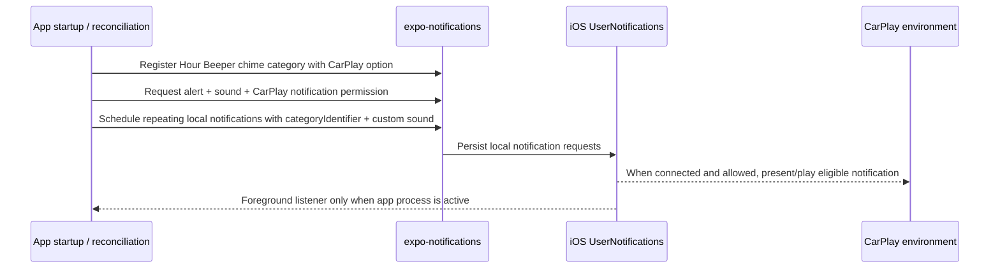

# feat: Support CarPlay notification beeps

## Overview

Make Hour Beeper's existing scheduled local-notification chimes eligible to play while the iPhone is connected to CarPlay, without adding a CarPlay app UI, background-audio mode, or a separate playback engine. The implementation should use iOS UserNotifications' CarPlay notification hooks through Expo where available, preserve the current notification-only delivery model, and add a device/simulator validation record for GitHub issue #6.

## Problem Frame

Issue #6 asks that scheduled hour beeps remain useful while driving: beeps should be audible through the car audio system when the phone is connected to CarPlay, should continue while the app is backgrounded, and should be documented/tested with a CarPlay connection or simulator where possible. The original product requirements prioritize closed-app delivery through platform-supported mechanisms and explicitly avoid promising invisible background sound when iOS requires notification surfaces (see origin: `docs/brainstorms/2026-04-16-hourly-chime-app-requirements.md`).

The repo has since converged on a notification-only delivery path: scheduled chimes are local notifications with bundled custom sounds, and `expo-audio` is used only for foreground sound previews. This plan therefore treats CarPlay support as notification eligibility and validation work first. A full CarPlay app, CarPlay audio entitlement, or background audio session is an escalation path only if real-device validation proves notification eligibility cannot satisfy the issue.

## Requirements Trace

- R1. Scheduled Hour Beeper notifications are registered under a stable notification category that is eligible for CarPlay display/playback where iOS and Expo expose that capability.
- R2. Notification permission requests ask for the existing alert/sound permissions and the CarPlay display permission option where Expo SDK 55 supports it.
- R3. All scheduled chime requests include the CarPlay-capable category identifier and existing custom sound filename, so backgrounded and terminated delivery continues to use the iOS notification scheduler rather than JS timers or background audio.
- R4. Existing scheduled requests without the category identifier migrate automatically through the current reconciliation fingerprint path.
- R5. Normal iPhone notification delivery remains unchanged when CarPlay is disconnected, unsupported, disabled in Settings, or suppressed by Focus/Silent Mode.
- R6. The repo documents a CarPlay validation matrix and records the limits of simulator vs physical CarPlay testing before closing issue #6.

## Scope Boundaries

- No CarPlay dashboard UI, templates, scenes, or `react-native-carplay` integration.
- No `com.apple.developer.carplay-audio` entitlement request in this first pass.
- No `UIBackgroundModes` audio/background playback mode for scheduled chimes.
- No change to foreground sound preview behavior in `src/features/chime/useSoundPreview.ts`.
- No promise to bypass Silent Mode, Driving Focus, Do Not Disturb, notification volume, or per-app “Show in CarPlay” settings.
- No push-notification or APNs entitlement work; the app remains local-notification-only.

### Deferred to Separate Tasks

- If real-device validation shows local notification categories cannot make the beep audible through CarPlay, create a separate investigation for native CarPlay entitlement/app-category feasibility and App Review constraints.
- If users need richer in-car controls later, plan that as a separate CarPlay product surface rather than expanding this notification eligibility change.

## Context & Research

### Relevant Code and Patterns

- `src/features/chime/notificationEngine.ts` is the scheduled delivery boundary. It builds notification content with `sound`, `threadIdentifier`, `interruptionLevel: "active"`, and Hour Beeper data, then reconciles desired requests against pending requests.
- `src/features/chime/notificationEngine.test.ts` already covers notification request shape, permission blocking, migration from stale request shapes, and reconciliation replacement behavior.
- `src/features/chime/permissions.ts` maps Expo permission responses into the app's simplified permission state.
- `plugins/withNotificationSoundsOnly.ts`, `app.config.ts`, and `src/features/chime/sounds.ts` keep bundled notification sound filenames aligned with the native iOS target.
- `src/features/chime/useSoundPreview.ts` sets `shouldPlayInBackground: false`; this is intentionally foreground preview only and should not be used for scheduled CarPlay beeps.
- `README.md` already warns that physical-device testing is required for notification delivery, custom sounds, Focus, silent switch, reboot/relaunch, and related platform behavior.

### Institutional Learnings

- There is no `docs/solutions/` directory and no prior CarPlay-specific learning in this repo.
- Prior plans emphasize separating foreground preview audio from scheduled notification delivery; scheduled chimes should remain notification-driven unless platform validation proves otherwise.
- Prior notification work uses adapter-style boundaries and Vitest-friendly pure request/fingerprint logic instead of testing Expo/native modules directly.

### External References

- Apple UserNotifications exposes `UNAuthorizationOptions.carPlay` for the ability to display notifications in CarPlay.
- Apple UserNotifications exposes `UNNotificationCategoryOptions.allowInCarPlay`; notifications without an explicitly CarPlay-allowed category may not display in CarPlay.
- Apple `UNNotificationSound` supports custom local notification sounds by assigning a sound name to local notification content.
- Expo Notifications documentation exposes custom notification sounds by filename after bundling, notification categories through `setNotificationCategoryAsync`, and iOS permission/category options including CarPlay display in current docs.
- Expo Notifications documentation notes that custom sounds can still be suppressed by Focus or Silent Mode; CarPlay should not be documented as a bypass.
- Apple CarPlay entitlements are required for actual CarPlay app experiences and should be treated as a separate escalation path, not the default implementation for this issue.

## Key Technical Decisions

- **Use notification-category CarPlay eligibility, not background audio.** The app's reliable closed/background delivery path is local notifications; adding audio background mode would create a second delivery model and conflict with the origin requirement to avoid promising hidden background sound.
- **Confirm Expo SDK 55 API support before wiring behavior.** The implementation should start by checking the installed `expo-notifications` types for the permission and category option names. If SDK 55 lacks either CarPlay hook, keep ordinary notification scheduling unchanged, document the unsupported hook, and stop short of pretending issue #6 is solved.
- **Register one stable chime category.** Use a single app-owned category for all Hour Beeper chimes so every schedule mode and sound gets the same CarPlay behavior.
- **Make category membership part of reconciliation.** Existing pending requests without the category should be replaced automatically and reported through migration-style diagnostics, just like prior stale trigger migrations.
- **Fail open for ordinary phone beeps when CarPlay registration fails.** Category registration failure should be recorded as degraded CarPlay eligibility, but it should not cancel existing working phone notifications or block normal local notification scheduling when general notification permission is granted.
- **Use an Expo-safe category identifier.** The stable chime category identifier should avoid characters Expo warns against for notification category identifiers; use `hourbeeperchime` unless installed SDK guidance requires a different safe value.
- **Treat visible CarPlay notifications as an accepted validation tradeoff.** This issue is about audible driving usefulness, and the origin document already accepts notification surfaces when required for closed-app delivery. Documentation should still call out that high-frequency dogfood schedules may be distracting in CarPlay.
- **Validate on real hardware before claiming issue closure.** Simulator checks can prove request/category shape, but physical CarPlay is required to prove audible routing through car speakers.

## Capability Gate and Failure Matrix

| Capability state                                                                                                 | Scheduling behavior                                                                                                                                                        | Diagnostics/docs behavior                                                                                                          |
| ---------------------------------------------------------------------------------------------------------------- | -------------------------------------------------------------------------------------------------------------------------------------------------------------------------- | ---------------------------------------------------------------------------------------------------------------------------------- |
| Expo SDK exposes CarPlay permission + category hooks, and category registration succeeds                         | Include `categoryIdentifier: hourbeeperchime`, migrate legacy requests on next app launch/reconciliation, and validate on CarPlay hardware                                 | Record CarPlay eligibility as registered/ready; README remains provisional until physical validation passes                        |
| Expo SDK lacks either CarPlay hook                                                                               | Do not add category fingerprints or migrate working phone notifications for a no-op; keep ordinary local notification scheduling unchanged                                 | Record/document unsupported Expo hook and create a native/escalation follow-up instead of closing issue #6                         |
| Category registration transiently fails                                                                          | Fail open for phone beeps: preserve existing matching requests or schedule category-less fallback rather than canceling working notifications solely for CarPlay migration | Record degraded CarPlay eligibility, retry registration on next startup/reconciliation, and clear the degraded state after success |
| General notification permission is granted but CarPlay permission/status is unreadable or already decided by iOS | Proceed with category-bearing scheduling only if registration succeeded; do not block ordinary scheduling on unreadable CarPlay status                                     | Document the Settings path for “Show in CarPlay” and require upgraded-user physical validation                                     |

## Open Questions

### Resolved During Planning

- **Should this build a CarPlay app UI?** No. Issue #6 asks for audible beeps through CarPlay, and Apple/Expo notification APIs provide a smaller first approach. CarPlay UI/entitlements remain a separate escalation if notification eligibility fails validation.
- **Should scheduled chimes switch to `expo-audio` background playback?** No. `expo-audio` is foreground preview only in this repo, and scheduled delivery needs to work while backgrounded or terminated.
- **Should this use push notifications or background notification tasks?** No. The current app is local-notification-only, and issue #6 does not require server delivery or JS execution on receipt.
- **Should the app re-prompt existing users automatically on startup?** No. Existing enabled users should migrate category-bearing requests on next launch/reconciliation when capability is available, but the app should not create surprise startup prompts. The explicit enable/request-permission path should ask with the CarPlay option; already-authorized users may still need the documented iOS Settings path.

### Deferred to Implementation

- **Exact Expo SDK 55 option names and response fields:** Implement against the installed `expo-notifications` types. Current docs point to CarPlay display authorization/category options, but the implementing agent should confirm whether the installed names are `allowDisplayInCarPlay`, `allowInCarPlay`, or a version-specific equivalent. If the installed SDK lacks these hooks, this plan should produce documentation/validation guidance rather than a false-positive implementation.
- **Whether Expo exposes a readable CarPlay authorization status:** If available, surface it in diagnostics or docs; if not, document that the app requests the option and users must verify “Show in CarPlay” in iOS Settings.
- **Physical CarPlay behavior for custom sounds:** Real routing, volume, and Focus interactions are platform/device behavior and must be recorded during validation.

## High-Level Technical Design

> _This illustrates the intended approach and is directional guidance for review, not implementation specification. The implementing agent should treat it as context, not code to reproduce._

Important boundary: CarPlay delivery must come from iOS delivering the scheduled local notification. JS runtime listeners and foreground `expo-audio` preview are not part of the backgrounded acceptance path.

## Implementation Units

- [x] **Unit 0: Prove CarPlay notification capability and closure criteria**

**Goal:** Establish whether the Expo/iOS notification-category approach can responsibly proceed before changing reconciliation behavior.

**Requirements:** R1, R2, R5, R6

**Dependencies:** None

**Files:**

- Create: `docs/testing/carplay-notification-beeps.md`
- Review: `package.json`
- Review: `src/features/chime/notificationEngine.ts`
- Review: `src/features/chime/permissions.ts`

**Approach:**

- Confirm the installed `expo-notifications` SDK 55 types expose both a CarPlay notification permission option and a CarPlay notification category option.
- Confirm the native/Expo constraints for notification category identifiers, and use `hourbeeperchime` as the planned stable category id unless SDK guidance requires another safe value.
- Use the validation doc to define pass/fail evidence before code migration work starts: which build, device/iOS/head unit or simulator, app state, notification settings, selected sound, and observed audio route must be recorded.
- If a physical CarPlay setup is available during implementation, run the smallest possible proof that a category-bearing local notification can appear/play in CarPlay before investing in full migration/diagnostics work.
- If SDK hooks are absent or validation proves non-CarPlay-approved apps cannot use the feature, stop Units 1–3 and produce a documented unsupported/escalation outcome instead.

**Patterns to follow:**

- `README.md` physical-device validation note for honest platform caveats.
- Existing notification adapter boundaries in `src/features/chime/notificationEngine.ts`.

**Test scenarios:**

- Test expectation: none -- feasibility/documentation unit. The output is a documented proceed/stop decision and validation matrix, not product behavior.

**Verification:**

- The implementer knows whether Units 1–3 are allowed to proceed.
- Issue #6 closure criteria are explicit before implementation changes can overclaim support.
- Unsupported SDK/platform outcomes preserve ordinary phone notification behavior and create a clear escalation path.

- [x] **Unit 1: Add a CarPlay-capable chime notification category boundary**

**Goal:** Create the app-owned notification category registration seam needed for CarPlay notification eligibility.

**Requirements:** R1, R5

**Dependencies:** Unit 0 proceed decision

**Files:**

- Modify: `src/features/chime/notificationEngine.ts`
- Modify: `src/features/chime/diagnostics.ts`
- Test: `src/features/chime/notificationEngine.test.ts`
- Test: `src/features/chime/diagnostics.test.ts`
- Review: `src/app/_layout.tsx`
- Review: `src/hooks/useChimeReconciliation.ts`

**Approach:**

- First confirm the installed `expo-notifications` SDK 55 category and permission type surface; use those types to choose the exact CarPlay option names.
- Define a stable category identifier for Hour Beeper chimes alongside the existing notification prefix/thread constants.
- Extend the notification client adapter with a small app-owned method for registering categories, rather than scattering direct Expo calls through UI or hooks.
- Register the chime category with no user actions and the iOS CarPlay category option supported by the installed Expo types.
- Ensure category registration runs before scheduling/reconciliation creates requests, and also during runtime setup if that is the earliest reliable startup boundary.
- Make the failure model fail-open for phone delivery: category registration failures should produce a warning/degraded CarPlay eligibility diagnostic, but should not cancel existing matching phone notifications or block normal scheduling when general notification permission is granted. Prefer a narrowly scoped CarPlay eligibility field over overloading the main reconciliation status as `error` when ordinary scheduling succeeds.
- If SDK 55 does not expose a CarPlay category hook, document that limitation and defer native escalation rather than adding a no-op category abstraction.

**Execution note:** Start with failing adapter/reconciliation tests that characterize the existing scheduling path, then add category registration expectations before changing the Expo boundary.

**Patterns to follow:**

- `src/features/chime/notificationEngine.ts` for existing Expo adapter isolation.
- `src/features/chime/notificationEngine.test.ts` for fake client tests around scheduling and reconciliation side effects.

**Test scenarios:**

- Happy path — enabling chimes with granted notification permission registers the chime category before scheduling any notification requests.
- Happy path — app startup/runtime configuration can register the same category idempotently without duplicating listeners or changing foreground behavior.
- Edge case — category registration remains schedule-independent: it occurs once/idempotently before scheduling regardless of whether the current settings use a preset or custom hours.
- Edge case — disabled chimes do not need to create new scheduled requests, but category registration can still be safely idempotent at startup.
- Error path — category registration failure is surfaced as degraded CarPlay eligibility while ordinary phone notification scheduling/retention remains fail-open when general permission is granted.
- Integration — permission denial still clears owned scheduled notifications as it does today; category registration does not weaken the existing blocked-state behavior.

**Verification:**

- The notification adapter has one clear category-registration boundary.
- Existing notification scheduling behavior still works with fake clients in tests.
- CarPlay category registration is observable in unit tests without requiring native Expo modules.
- A category-registration failure can be distinguished from a normal scheduling failure in diagnostics or reconciliation output.
- Requests only include `categoryIdentifier: hourbeeperchime` after the capability gate indicates category registration is supported and did not hard-fail.

- [x] **Unit 2: Schedule category-bearing chime requests and migrate old requests**

**Goal:** Add the CarPlay-capable category identifier to every Hour Beeper notification request and make reconciliation replace legacy requests that lack it.

**Requirements:** R1, R3, R4, R5

**Dependencies:** Units 0–1 proceed path

**Files:**

- Modify: `src/features/chime/notificationEngine.ts`
- Test: `src/features/chime/notificationEngine.test.ts`

**Approach:**

- Add `categoryIdentifier` to the app-owned notification content type, runtime event content typing, scheduled/presented record content, and record normalization path.
- Include the stable chime category identifier in requests only when the Unit 0/1 capability gate confirms the installed SDK supports category registration and registration did not hard-fail.
- Include category identifier in request and record fingerprints only in that proceed path; unsupported/degraded paths must not force category migration for otherwise-working phone notifications.
- Treat category-less or wrong-category owned repeaters as a migration condition, not just an ordinary schedule replacement, so diagnostics can explain upgraded-user behavior.
- Avoid cancel-before-success loss for category-only migrations: preserve old requests or recreate category-less fallback if replacement scheduling fails.
- Preserve existing `sound`, `threadIdentifier`, `interruptionLevel`, and data payload fields unchanged.
- Keep the existing custom sound catalog/native bundling path untouched; CarPlay support should not introduce a second sound mapping.

**Execution note:** Add migration/fingerprint tests before implementation so old category-less pending requests are proven to be replaced.

**Patterns to follow:**

- Existing fingerprint fields in `getRequestFingerprint` and `getRecordFingerprint`.
- Existing stale-date migration tests in `src/features/chime/notificationEngine.test.ts`.
- `src/features/chime/sounds.ts` for sound filename lookup.

**Test scenarios:**

- Happy path — built notification requests include the chime category identifier for every preset in `PRESET_SCHEDULE_IDS` and for custom schedules.
- Happy path — custom sound filenames remain unchanged when the category identifier is added.
- Edge case — an existing pending Hour Beeper request with matching trigger/sound/thread but missing `categoryIdentifier` does not match the desired plan and is rescheduled.
- Edge case — an existing pending request with the wrong category identifier is rescheduled.
- Edge case — upgraded users with already-granted notification permission migrate category-less requests on next app launch/reconciliation without needing to toggle chimes or see a new permission prompt.
- Edge case — users who update the app but do not open it before driving may keep old non-category repeaters until the next launch/reconciliation; docs and validation should state this clearly.
- Error path — replacement scheduling failure during category migration does not leave the user with no ordinary phone beep schedule.
- Error path — unsupported or failed category registration records degraded CarPlay eligibility and skips category fingerprint migration rather than making pending requests look CarPlay-ready.
- Integration — foreground notification handler still suppresses banner/list and plays sound while the app is active; category changes do not alter foreground behavior.

**Verification:**

- All desired notification requests carry the same stable chime category identifier.
- Reconciliation migrates category-less requests without requiring users to toggle settings manually.
- Category-only migrations have an observable status or diagnostic entry rather than being indistinguishable from an unrelated reschedule.
- Current tests for schedule counts, identifiers, sounds, and permission blocking remain meaningful.

- [x] **Unit 3: Request and represent CarPlay notification permission safely**

**Goal:** Ask iOS for CarPlay notification display eligibility where Expo supports it, while preserving the app's simple permission model and existing notification UX.

**Requirements:** R2, R5

**Dependencies:** Unit 0 proceed decision and Unit 1 adapter boundary

**Files:**

- Modify: `src/features/chime/notificationEngine.ts`
- Modify: `src/features/chime/permissions.ts`
- Test: `src/features/chime/notificationEngine.test.ts`
- Create: `src/features/chime/permissions.test.ts` if permission mapping gains CarPlay-specific fields
- Test: `src/features/chime/diagnostics.test.ts` if diagnostics state changes
- Modify: `src/features/chime/diagnostics.ts` if Expo exposes actionable CarPlay status
- Modify: `src/components/settings/DiagnosticsSection.tsx` if CarPlay status is displayed in diagnostics
- Modify: `src/components/settings/diagnosticsDisplay.ts` if CarPlay status formatting is added
- Test: `src/components/settings/diagnosticsDisplay.test.ts` if diagnostics formatting changes
- Modify: `src/components/settings/permissionBannerModel.ts` only if the app can surface an actionable denied/disabled state
- Test: `src/components/settings/PermissionBanner.test.ts` only if banner copy changes

**Approach:**

- Extend the existing explicit permission request path to include the CarPlay notification option supported by the installed Expo SDK 55 types while keeping `allowAlert: true`, `allowSound: true`, and `allowBadge: false`.
- Do not surprise-prompt already-enabled users on startup. Startup/reconciliation may read permission state and migrate requests when category registration succeeds, but any fresh permission prompt should remain tied to a user action such as enabling chimes or tapping a request-permission control.
- Add or expose a test seam that lets unit tests assert the app-owned permission request options; current fake `NotificationPermissionClient.requestPermissionsAsync()` does not accept options, so adapter-level behavior needs explicit coverage.
- Keep `NotificationPermissionState.isGranted` tied to the general notification authorization needed to schedule local notifications.
- If Expo exposes CarPlay-specific settings in `getPermissionsAsync`, map them into diagnostics or a narrowly named field without making CarPlay permission a blocker for ordinary phone beeps.
- If Expo does not expose readable CarPlay status, avoid speculative UI state; document the Settings path instead.
- Avoid broadening notification permissions beyond what Hour Beeper needs. Do not request critical alerts, time-sensitive authorization, badges, or remote notification capabilities as part of this issue.

**Patterns to follow:**

- `src/features/chime/permissions.ts` for reducing Expo permission responses to app-level state.
- `src/components/settings/permissionBannerModel.ts` for small, status-driven permission copy.
- Existing diagnostics history sanitization in `src/features/chime/diagnostics.ts` if state shape changes.

**Test scenarios:**

- Happy path — the Expo permission request includes alert, sound, no badge, and the CarPlay display option.
- Happy path — a normal granted notification permission still maps to `isGranted: true` even if CarPlay-specific status is absent or unknown.
- Edge case — existing permission responses without any CarPlay fields sanitize/map correctly for upgraded users.
- Edge case — denied general notification permission still maps to blocked scheduling exactly as before.
- Edge case — existing users with granted notification permission can still schedule/migrate category-bearing requests even if iOS does not show a new CarPlay prompt.
- Error path — permission request failure continues to surface through existing reconciliation error handling.
- Integration — if user-facing permission/banner copy is added, denied/unknown CarPlay state tells users to check iOS notification settings without implying the app can bypass Focus or Silent Mode.

**Verification:**

- Enabling chimes still requests only the required notification capabilities.
- The app does not block ordinary scheduling solely because CarPlay status is unreadable.
- Any new diagnostics or banner state survives persistence sanitization.

- [x] **Unit 4: Document and record CarPlay validation evidence**

**Goal:** Provide the manual validation matrix needed to close issue #6 honestly, including simulator limits and escalation criteria.

**Requirements:** R5, R6

**Dependencies:** Validation template: none. Final evidence recording: Units 1–3.

**Files:**

- Create: `docs/testing/carplay-notification-beeps.md`
- Modify: `README.md`
- Modify: `TODO.md`

**Approach:**

- Add a focused validation doc for CarPlay notification beeps with setup, expected results, and an observation table; the template can land before code changes, while final observations depend on Units 1–3.
- Cover physical CarPlay as the source of truth for audible routing; mark simulator validation as useful for category/request/display checks but insufficient for the audible acceptance criterion.
- Include test cases for app backgrounded, locked, and terminated/force-killed after scheduling as the acceptance-critical states. Foregrounded behavior may be recorded as informational because the app's foreground handler intentionally differs from background system delivery.
- Include upgraded-user validation: install/authorize the pre-CarPlay build, upgrade to the CarPlay build, verify category migration, and check whether iOS requires manually enabling “Show in CarPlay.”
- Include settings/environment cases: “Show in CarPlay” on/off if visible, per-app Sounds on/off, Deliver Quietly/Scheduled Summary if available, Driving Focus/DND on/off, Silent Mode on/off, active car media playback, car/iPhone notification volume, and CarPlay disconnected fallback.
- Include default-vs-bundled-sound isolation before escalation: validate whether the default system notification sound works through CarPlay and whether each bundled Hour Beeper sound class works or is replaced/suppressed.
- Document escalation criteria: only open native CarPlay entitlement/background-audio investigation if category-bearing local notifications fail audibility under normal allowed settings after ruling out per-app settings, Focus/Silent Mode, and custom sound asset routing.
- Keep docs provisional until physical validation passes; README should distinguish planned support, implemented-but-unvalidated support, and physically validated behavior.
- Update README's physical-device testing note to reference the CarPlay validation doc and state this is notification-driven, not a dedicated CarPlay app.
- Update `TODO.md` under its existing long-run validation matrix with CarPlay-specific checks rather than adding a generic reminder.

**Patterns to follow:**

- Existing README tone: concise, practical, and explicit about physical-device requirements.
- Existing TODO validation checklist for platform behavior that cannot be proven in unit tests.

**Test scenarios:**

- Test expectation: none -- documentation-only unit. The validation doc itself must enumerate manual scenarios with setup/action/expected result.

**Verification:**

- Issue #6 has a documented path for proving backgrounded CarPlay audibility.
- The docs distinguish supported behavior from platform-controlled limitations.
- Future implementers know exactly when to escalate beyond notification-category support.

## Issue #6 Closure Criteria

Issue #6 should close only when the validation record shows:

- A category-bearing scheduled local notification is audible through physical CarPlay while the app is backgrounded or the phone is locked.
- A terminated/force-killed app scenario is attempted and the result is recorded, even if iOS behavior differs from backgrounded delivery.
- At least one bundled Hour Beeper sound is validated; if custom sounds are suppressed or replaced, the default notification sound comparison is recorded and the issue outcome states whether “any audible beep” or “selected sound fidelity” was achieved.
- The validation record names the build variant, iOS version, device model, car/head unit or simulator, notification settings, Focus/Silent Mode state, selected schedule, selected sound, and observed audio route.
- Upgraded-user behavior is documented: category migration happens only after the app next launches/reconciles, and existing users may need to verify “Show in CarPlay” in iOS Settings.
- README language is not upgraded from provisional to validated until physical CarPlay evidence exists.

## System-Wide Impact

- **Interaction graph:** `HomeScreen`/settings enablement triggers permission request and reconciliation through `useChimeReconciliation`; `notificationEngine` registers categories, schedules local requests, and foreground runtime cleanup remains best-effort.
- **Error propagation:** General notification permission denial remains a blocked state. Category-registration or CarPlay-specific failures should be fail-open for ordinary phone beeps: visible as degraded CarPlay eligibility in diagnostics/errors, but not allowed to silently remove existing working phone notifications.
- **State lifecycle risks:** Pending requests created before this change need automatic migration on next app launch/reconciliation through fingerprint mismatch; users who update but do not open the app before driving may keep non-CarPlay-eligible repeaters until reconciliation runs. Category migration must not cancel working phone repeaters unless replacement/fallback scheduling succeeds.
- **API surface parity:** All schedule kinds and all bundled sounds must receive the same category treatment. Foreground preview must remain separate and unchanged.
- **Integration coverage:** Unit tests can prove category/permission/request shape and migration. Only physical CarPlay can prove audible routing through the car.
- **Unchanged invariants:** The app remains local-notification-only, uses the same sound catalog, keeps notification cleanup best-effort, and does not promise Silent Mode/Focus bypass.

## Risks & Dependencies

| Risk                                                                                                       | Mitigation                                                                                                                                                                       |
| ---------------------------------------------------------------------------------------------------------- | -------------------------------------------------------------------------------------------------------------------------------------------------------------------------------- |
| Expo SDK 55 uses different CarPlay option names than current docs, or lacks one of the CarPlay hooks       | Confirm against installed `expo-notifications` types before wiring behavior; if unsupported, preserve normal scheduling and document the limitation instead of shipping a no-op. |
| iOS may not re-prompt existing users for CarPlay display after notification permission was already granted | Document the Settings path and avoid treating unknown CarPlay status as ordinary notification failure.                                                                           |
| CarPlay simulator cannot prove audible routing                                                             | Require physical CarPlay validation before closing issue #6.                                                                                                                     |
| Apple may require CarPlay approval/entitlement for the notification option to have effect                  | Treat Unit 0 as a hard gate and only close issue #6 after physical validation proves this app works without a dedicated CarPlay app entitlement.                                 |
| Focus, Silent Mode, per-app Sounds, Deliver Quietly/Summary, or “Show in CarPlay” settings suppress sounds | Document these platform controls and include them in the validation matrix.                                                                                                      |
| Adding category registration accidentally changes normal notification delivery                             | Preserve existing sound/thread/interruption fields, fail open for category-registration problems, and cover all schedule kinds in request-shape tests.                           |
| Category migration cancels old repeaters before replacement succeeds                                       | Gate category migration on successful capability setup and require fallback/preservation coverage for replacement failures.                                                      |
| Documentation overclaims before hardware evidence exists                                                   | Keep README language provisional until the validation record contains physical CarPlay evidence.                                                                                 |
| Notification category support is insufficient without CarPlay entitlement                                  | Treat entitlement/native CarPlay work as a separate escalation only after physical validation fails under normal allowed settings.                                               |

## Documentation / Operational Notes

- The validation doc should record date, build variant, iOS version, device model, car/head unit or simulator version, app state, prior-install/upgrade status, Focus/Silent Mode, selected sound, observed audio route, and whether a visible notification remained.
- README should state that CarPlay support is notification-driven and platform-controlled, not a dedicated CarPlay app.
- If validation passes, GitHub issue #6 can be closed with the validation doc path and summarized physical-device observations.

## Sources & References

- **Origin document:** [docs/brainstorms/2026-04-16-hourly-chime-app-requirements.md](../brainstorms/2026-04-16-hourly-chime-app-requirements.md)
- **GitHub issue:** [#6 Support beeps in CarPlay](https://github.com/pvinis/hour-beeper/issues/6)
- Related code: `src/features/chime/notificationEngine.ts`
- Related code: `src/features/chime/permissions.ts`
- Related code: `src/features/chime/useSoundPreview.ts`
- Related code: `plugins/withNotificationSoundsOnly.ts`
- Related docs: `README.md`
- External docs: Apple Developer Documentation for `UNAuthorizationOptions.carPlay`, `UNNotificationCategoryOptions.allowInCarPlay`, and `UNNotificationSound`
- External docs: Expo Notifications documentation for custom notification sounds, notification categories, and iOS permission options
- External docs: Apple CarPlay entitlement documentation for escalation context
