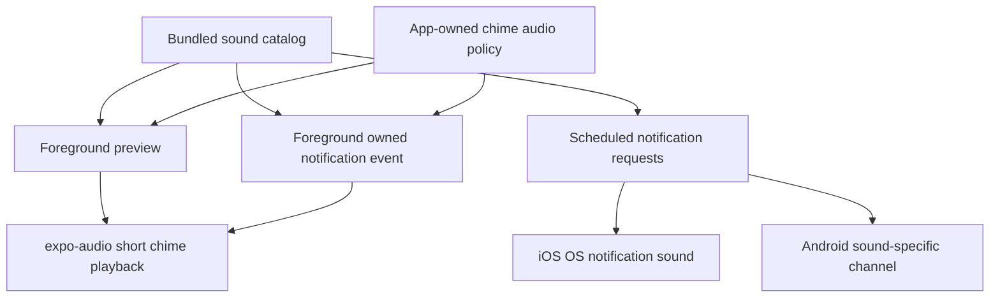
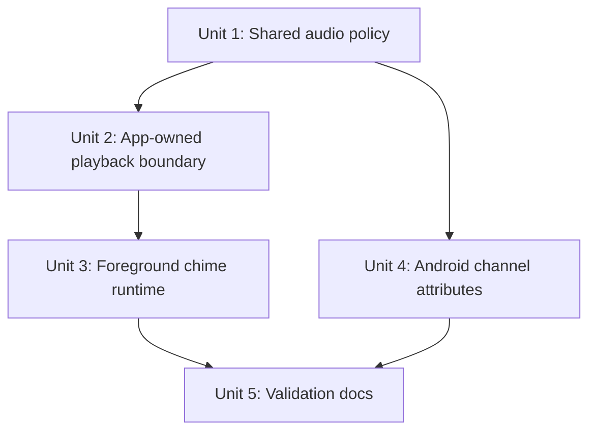
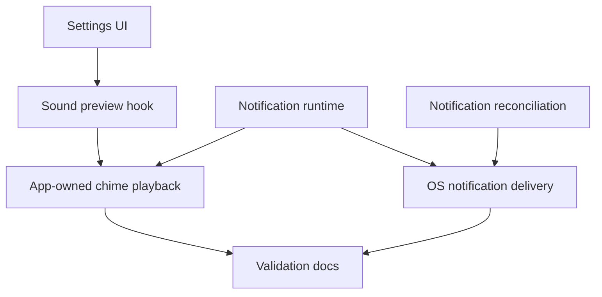

# fix: Preserve media playback during chimes

## Overview

GitHub issue #7 asks Hour Bell to play its brief beep without stopping music, podcasts, audiobooks, or other active media. The implementation should improve every audio path the app actually controls, while being explicit about the platform boundary: foreground/app-owned audio can use `expo-audio` mix/duck policy, but background, locked, and terminated scheduled chimes are local notification sounds owned by iOS/Android notification systems.

The plan therefore splits the work into three behavior surfaces:

| Surface | Current owner | Planned posture |
| --- | --- | --- |
| Foreground sound preview | App-owned `expo-audio` playback | Keep app-owned playback configured to mix by default, make the policy named/tested, and optionally allow a deliberate ducking decision after device validation. |
| Foreground scheduled chime | `expo-notifications` foreground notification sound | Route owned foreground chimes through app-owned playback to avoid relying on OS notification audio while the app is active. |
| Background/locked/terminated scheduled chime | OS local notification sound | Validate honestly; improve Android channel metadata where available, but do not claim iOS AVAudioSession control over OS-delivered notification sounds. |

## Problem Frame

Hour Bell is intentionally a notification-only recurring chime app: it schedules local notifications with bundled custom sounds so chimes can fire when the app is not open (see origin: `docs/brainstorms/2026-04-16-hourly-chime-app-requirements.md`). That delivery model gives closed-app reliability, but it also means the most important chime path is not the same as the foreground preview path.

The issue's desired behavior is still valid: a short watch-like beep should feel like UI feedback layered over the user's current listening session, not like a media interruption. The technical challenge is that the repo has two different sound owners:

- `src/features/chime/useSoundPreview.ts` uses `expo-audio`, where `interruptionMode: "mixWithOthers"` and `"duckOthers"` are meaningful audio-session settings.
- `src/features/chime/notificationEngine.ts` uses `expo-notifications`, where iOS background/locked/terminated sound playback is performed by the OS notification subsystem, not by the app's active `expo-audio` player.

This plan improves the app-controlled surfaces first, adds Android notification channel audio metadata for the OS-controlled Android path, and creates a physical-device validation path for deciding whether any remaining iOS background behavior is a platform limitation or needs a separate native/delivery-mode investigation.

## Requirements Trace

- R1. When a user previews a bundled sound while other media is playing, the preview beep should be audible and the other media should continue.
- R2. When a scheduled Hour Bell chime fires while the app is foregrounded and other media is playing, the chime should be audible and the other media should continue.
- R3. When a scheduled chime fires while the app is backgrounded, locked, or terminated, the app must preserve current notification delivery reliability and validate whether platform notification audio mixes, ducks, pauses, or suppresses other media.
- R4. Android notification channels should use deliberate audio attributes for short chime/sonification playback where Expo SDK 55 exposes them, without silently breaking existing channel behavior.
- R5. If iOS OS-delivered local notification sounds cannot be controlled with AVAudioSession/expo-audio settings, the implementation must document that boundary instead of implying the app can guarantee background media mixing.
- R6. Tests and docs should distinguish foreground app-owned audio from OS-owned notification sound so future changes do not re-collapse the two concepts.
- R7. Physical-device validation should cover Apple Music, Podcasts, Spotify, silent mode, background/locked/terminated delivery, and Android channel upgrade/fresh-install behavior where possible.

## Scope Boundaries

- No switch away from notification-only closed-app delivery in this plan.
- No background audio service, continuous silent audio session, lock-screen controls, recording, or media-player UI.
- No Critical Alerts entitlement, Focus/DND bypass, alarm category revival, or attempt to bypass user notification settings.
- No promise that iOS background/locked/terminated local notification sounds can be forced to mix with media if the OS chooses otherwise.
- No new bundled sounds or changes to schedule semantics.

### Deferred to Separate Tasks

- Native iOS delivery alternative for guaranteed non-interrupting closed-app audio: only if validation proves local notification audio fails the product bar and a feasible Apple-approved path exists.
- Broader Android exact-alarm/native scheduling remediation: already deferred by Android validation planning if Expo repeating notifications do not meet timing/reliability needs.

## Context & Research

### Relevant Code and Patterns

- `src/features/chime/useSoundPreview.ts` configures foreground preview with `interruptionMode: "mixWithOthers"`, `playsInSilentMode: true`, `allowsRecording: false`, and `shouldPlayInBackground: false`.
- `src/features/chime/soundPreview.ts` is a pure, injected playback controller that already contains preview errors and is covered by `src/features/chime/soundPreview.test.ts`.
- `src/features/chime/notificationEngine.ts` builds local notification requests, owns foreground notification behavior, registers runtime notification listeners, dismisses stale presented notifications, and creates Android notification channels.
- `src/features/chime/notificationEngine.ts` currently sets foreground notification behavior to suppress banner/list but keep `shouldPlaySound: true`, meaning foreground scheduled chimes still use notification-owned sound.
- `src/features/chime/notificationEngine.ts` currently creates Android channels with `importance` and `sound` only.
- `node_modules/expo-notifications/src/NotificationChannelManager.types.ts` exposes Android `audioAttributes` with `AndroidAudioUsage` and `AndroidAudioContentType` values, including `ASSISTANCE_SONIFICATION`, `NOTIFICATION`, and `SONIFICATION`.
- `README.md` already states that foreground preview is UI feedback only and scheduled notification delivery must be physically validated.
- `docs/android-validation.md` already separates foreground preview from scheduled notification playback and is the natural place to add media-continuity checks.

### Institutional Learnings

- There is no `docs/solutions/` directory yet, so durable local learning comes from prior plans and current code.
- `docs/plans/2026-04-29-001-feat-sound-preview-plan.md` explicitly warns not to assume foreground preview audio-session behavior affects scheduled notification delivery.
- `docs/plans/2026-04-16-001-feat-hourly-chime-dual-mode-plan.md` and later notification plans frame local notifications as the reliability path for closed-app delivery, with visible/user-facing OS tradeoffs.
- `docs/plans/2026-05-11-001-feat-android-platform-support-plan.md` records that Android notification sound behavior is channel-based and user/system-owned after channel creation.

### External References

- Expo SDK 55 `expo-audio` docs: `setAudioModeAsync` supports `interruptionMode: "mixWithOthers" | "duckOthers" | "doNotMix"`; `mixWithOthers` plays alongside other apps, and `duckOthers` lowers other audio while app audio plays.
- Expo SDK 55 `expo-audio` implementation maps `mixWithOthers` / `duckOthers` to iOS `AVAudioSession.CategoryOptions` for app-owned playback.
- Apple AVAudioSession docs: `mixWithOthers` and `duckOthers` are options for an app audio session; `duckOthers` implicitly mixes and reduces other sessions while the app plays audio.
- Expo Notifications docs/types: foreground notifications use a notification handler with `shouldPlaySound`; Android 8+ notification sound behavior is controlled by notification channels.

## Key Technical Decisions

- **Keep `mixWithOthers` as the default app-owned audio policy.** The issue asks for a brief beep on top of existing media; mixing is less intrusive than ducking and matches the current preview implementation. Device validation can still compare ducking as a product feel choice.
- **Extract a reusable app-owned chime playback boundary instead of duplicating preview logic in notification runtime.** Foreground previews and foreground scheduled chimes both need short bundled-sound playback with a shared media-continuity policy, but scheduled notification code should not import UI hooks.
- **Keep silent-mode semantics explicit for foreground scheduled chimes.** Preview currently uses `playsInSilentMode: true` because it is user-initiated UI feedback. Foreground scheduled chimes should inherit that policy only if the team accepts that app-owned foreground chimes may sound when an OS notification sound might have respected silent switch; otherwise the playback boundary should expose a distinct scheduled-chime policy.
- **Disable OS notification sound only for owned foreground chimes when app-owned playback is available and metadata is trustworthy.** This avoids double beeps and keeps the foreground chime under the app's mix/duck policy. If ownership, sound metadata, or playback readiness is uncertain, foreground handling should fall back to OS notification sound rather than silently dropping the chime.
- **Use conditional foreground notification presentation, not broad global suppression.** Expo's foreground notification handler receives notification context, so the implementation should suppress OS sound only for Hour Bell-owned chime notifications that will be handled by app-owned playback. Future non-chime foreground notifications should retain their own presentation behavior.
- **Treat iOS closed-app notification mixing as a validation finding, not a code assertion.** AVAudioSession options in `expo-audio` should not be presented as controlling OS-delivered local notification sounds.
- **Add Android channel audio attributes deliberately and preserve channel stickiness.** Default to notification semantics (`NOTIFICATION` usage with sonification content) unless validation intentionally chooses another usage and accepts any routing/DND/volume-stream consequences. If audio attributes change existing channel behavior, use versioned channel IDs or document a reinstall/channel-reset requirement rather than assuming Android mutates user-owned channels.
- **Make validation part of the fix.** The acceptance criteria are experiential and platform-dependent, so code-level assertions must be paired with physical-device checks.

## Open Questions

### Resolved During Planning

- **Should this plan change scheduled delivery away from notifications?** No. Closed-app delivery remains notification-only; this plan improves controlled surfaces and documents OS limits.
- **Should the default app-owned behavior be mix or duck?** Start with `mixWithOthers`; it is less disruptive and already matches the preview code. Ducking remains an explicit validation comparison if the beep is not audible enough over media.
- **Can foreground scheduled chimes use app-owned playback?** Yes, while the app is active and receives notification events, owned notifications can be recognized from their existing metadata and played through a reusable playback boundary.
- **Can iOS background/locked/terminated local notification sound mixing be guaranteed from JS?** No responsible plan should assume that. Treat it as OS-owned behavior to validate and document.

### Deferred to Implementation

- **Exact Expo API shape for importing Android notification audio enums:** The installed SDK types expose the concepts, but implementation should choose the least brittle import/reference pattern while touching `expo-notifications`.
- **Whether Android audio attributes require channel ID versioning immediately:** Decide after checking current installed-channel behavior and whether a fresh channel can be introduced without unnecessary user churn.
- **Whether foreground scheduled chimes should share preview silent-mode behavior:** Use implementation/device validation to decide whether `playsInSilentMode: true` is acceptable for scheduled foreground chimes or whether the playback boundary needs a distinct scheduled-chime policy.
- **Whether ducking feels better than plain mixing for the bundled sounds:** Decide through physical-device validation with real media volume levels.

## High-Level Technical Design

> *This illustrates the intended approach and is directional guidance for review, not implementation specification. The implementing agent should treat it as context, not code to reproduce.*

The central separation is ownership: foreground preview and foreground owned notification playback can share an `expo-audio` policy, while scheduled notification requests must continue to carry platform notification sound metadata for states where the app cannot execute JavaScript.

## Implementation Units

- [x] **Unit 1: Name and test the app-owned chime audio policy**

**Goal:** Make the foreground/app-owned audio-session choice explicit so preview and foreground scheduled chime playback cannot drift.

**Requirements:** R1, R2, R6

**Dependencies:** None

**Files:**
- Modify: `src/features/chime/useSoundPreview.ts`
- Create: `src/features/chime/audioPolicy.ts`
- Test: `src/features/chime/audioPolicy.test.ts`
- Test: `src/features/chime/soundPreview.test.ts`

**Approach:**
- Extract the current preview audio mode into a small pure or adapter-friendly module that names the product policy: app-owned chime audio should mix with other media, play in silent mode for user-initiated/app-owned beeps, avoid recording, and avoid background playback.
- Keep the default policy at `mixWithOthers`; do not switch to `duckOthers` without physical-device evidence that mixed beeps are too quiet.
- Keep the policy focused on app-owned audio. Comments/tests should explicitly say it does not control OS-delivered local notification sounds.
- Preserve the existing preview behavior by having `useSoundPreview.ts` consume the shared policy rather than inline the object.
- Require a testable seam for audio-mode setup so preview usage of the shared policy is covered, not just the policy object itself.

**Patterns to follow:**
- `src/features/chime/useSoundPreview.ts` for current Expo audio configuration.
- `src/features/chime/soundPreview.ts` and `src/features/chime/soundPreview.test.ts` for pure boundary plus injected side-effect patterns.

**Test scenarios:**
- Happy path — the app-owned chime audio policy uses `interruptionMode: "mixWithOthers"`, `playsInSilentMode: true`, `allowsRecording: false`, and `shouldPlayInBackground: false`.
- Edge case — if a future change sets `interruptionMode: "doNotMix"`, the policy test fails because that would reintroduce media interruption for app-owned playback.
- Integration — preview setup calls `setAudioModeAsync` with the exported app-owned policy when the preview hook mounts.

**Verification:**
- Foreground preview keeps the same behavior as before, but the intended media-continuity policy is now named, tested, and reusable.

- [x] **Unit 2: Create reusable app-owned chime playback for non-UI runtime use**

**Goal:** Let notification runtime play an owned chime through `expo-audio` without depending on React hooks or the settings UI.

**Requirements:** R1, R2, R6

**Dependencies:** Unit 1

**Files:**
- Create: `src/features/chime/chimePlayback.ts`
- Modify: `src/features/chime/soundPreview.ts`
- Modify: `src/features/chime/soundPreviewAssets.ts`
- Test: `src/features/chime/chimePlayback.test.ts`
- Modify: `src/features/chime/useSoundPreview.ts`

**Approach:**
- Promote the existing injected playback controller into a runtime-safe app-owned chime playback boundary that can resolve a `ChimeSound`, apply the shared audio policy before playback, restart the requested bundled sound, and contain playback errors.
- Keep React hook lifecycle management in `useSoundPreview.ts`; the non-UI runtime should use an injected or lazily-created playback client so `notificationEngine.ts` stays testable.
- Do not rely on `useSoundPreview.ts` being mounted before notification runtime playback. Either the non-React playback path applies the audio policy itself, or root bootstrap guarantees the policy is installed before foreground notification sound is suppressed.
- Avoid adding background playback, lock-screen metadata, continuous players, or media controls. This is still short sound-effect playback.
- Preserve rapid-preview behavior and non-blocking error handling from the current `soundPreview.ts` tests.

**Patterns to follow:**
- `src/features/chime/soundPreview.ts` for injected player operations and stale rapid-request protection.
- `src/features/chime/soundPreviewAssets.ts` for bundled asset resolution.
- `docs/plans/2026-04-29-001-feat-sound-preview-plan.md` for keeping preview/app-owned playback separate from notification scheduling state.

**Test scenarios:**
- Happy path — app-owned playback applies the shared audio policy, resolves the requested sound, restarts it from the beginning, and plays once.
- Happy path — repeated requests for the same sound replay it rather than no-oping.
- Edge case — rapid overlapping requests only let the latest request call play.
- Error path — asset resolution, seek, replace, or play failures are reported/contained and do not reject into notification runtime or UI selection flow.
- Integration — preview UI continues to use the same playback boundary and still supports every `CHIME_SOUND_IDS` value.

**Verification:**
- A non-React caller can request short chime playback for a `ChimeSound` using the same app-owned policy as preview.

- [x] **Unit 3: Route foreground owned scheduled chimes through app-owned playback**

**Goal:** When the app is active and a scheduled Hour Bell notification is received, prevent duplicate OS notification sound and play the chime through the app-owned mixed audio path instead.

**Requirements:** R2, R3, R5, R6

**Dependencies:** Unit 2

**Files:**
- Modify: `src/features/chime/notificationEngine.ts`
- Test: `src/features/chime/notificationEngine.test.ts`
- Modify: `src/app/_layout.tsx` only if runtime dependency injection/bootstrap needs a new playback adapter
- Modify: `src/features/chime/sounds.ts` only if sound metadata needs an additional runtime lookup helper

**Approach:**
- Extend the notification runtime dependencies with an optional app-owned chime playback adapter.
- In the foreground notification received listener, detect Hour Bell-owned notifications from existing notification data, read the `sound` value, and request app-owned playback for that sound.
- Change foreground notification behavior so owned foreground chimes do not also play the OS notification sound when app-owned playback is available.
- Use notification metadata in the foreground handler to make presentation conditional: Hour Bell-owned chime notifications can suppress OS sound and use app-owned playback; unknown or future non-chime notifications should not lose their OS sound by default.
- Preserve a no-adapter/no-metadata fallback: if the playback adapter is absent, not ready, or the delivered sound metadata is invalid, keep OS foreground sound rather than creating a silent chime.
- Make the foreground notification handler and received listener share the same ownership/readiness decision so the handler never suppresses OS sound for a notification the listener cannot play through app-owned audio.
- Preserve existing cleanup behavior: receipt-time dismissal of the previous Hour Bell notification and app-active sweeping should continue to run.
- Do not alter scheduled notification content sounds for background/locked/terminated delivery; those states still need OS notification sound metadata.

**Execution note:** Add characterization tests around current foreground notification behavior and cleanup before changing the sound handling path.

**Patterns to follow:**
- `configureNotificationRuntime(...)` in `src/features/chime/notificationEngine.ts` for runtime listener registration and dependency injection.
- `dismissPreviousPresentedHourBeeperNotification(...)` tests in `src/features/chime/notificationEngine.test.ts` for owned-notification filtering.
- `HourBeeperNotificationData.sound` as the existing source of truth for the selected sound on a delivered notification.

**Test scenarios:**
- Happy path — an owned foreground notification with `data.sound: "bellio"` and an available playback adapter asks the app-owned playback adapter to play `bellio` and suppresses foreground OS notification sound.
- Happy path — existing previous-notification dismissal still runs for the same owned foreground notification.
- Edge case — a notification without Hour Bell ownership metadata does not trigger app-owned chime playback and keeps default OS foreground sound behavior.
- Edge case — an owned notification received before the playback adapter is installed keeps OS foreground sound behavior instead of becoming silent.
- Edge case — an owned notification with missing or invalid sound metadata does not crash runtime initialization and does not play an arbitrary fallback unless the implementation explicitly chooses and tests one.
- Error path — app-owned playback failure is logged/contained and does not prevent notification cleanup listeners from continuing to operate; the plan accepts that a playback failure after deliberate OS-sound suppression may miss that foreground beep unless implementation can safely detect readiness before suppression.
- Integration — scheduled notification requests still include `content.sound` for iOS and Android background/locked/terminated delivery.

**Verification:**
- Foreground scheduled chimes use the same mixed app-owned audio path as preview, while closed-app notification delivery remains intact.

- [x] **Unit 4: Add deliberate Android notification-channel audio attributes**

**Goal:** Improve the Android OS-owned notification path by making channel audio behavior intentional for short chime sounds and safe across fresh installs/upgrades.

**Requirements:** R3, R4, R6, R7

**Dependencies:** Unit 1

**Files:**
- Modify: `src/features/chime/notificationEngine.ts`
- Modify: `src/features/chime/sounds.ts` if channel IDs need versioning
- Test: `src/features/chime/notificationEngine.test.ts`
- Modify: `docs/android-validation.md`

**Approach:**
- Extend `AndroidNotificationChannelDefinition` to include audio attributes appropriate for brief notification/sonification sounds, using Expo SDK 55 notification channel types.
- Use notification usage with sonification content as the baseline attribute decision because these are notification channels. Treat `ASSISTANCE_SONIFICATION` as an explicit alternative only if validation shows notification usage is too disruptive and the team accepts any routing, DND, or volume-stream differences.
- Decide whether channel IDs need a version suffix before shipping the change. Android may not update sound/audio attributes for existing user-owned channels, so fresh-install and upgrade behavior must be considered separately.
- Keep one effective channel per chime sound unless validation proves a different shape is needed. The sound catalog remains the source of channel IDs.
- Preserve blocked-channel detection and scheduling behavior. If implementation can read channel audio attributes back, diagnostics may report mismatches; if not, validation docs should say the attribute is not observable in-app.

**Patterns to follow:**
- `getAndroidNotificationChannelDefinitions()` in `src/features/chime/notificationEngine.ts` for catalog-driven channel generation.
- Android channel stickiness warnings in `docs/plans/2026-05-11-001-feat-android-platform-support-plan.md`.
- `docs/android-validation.md` for fresh-install vs upgrade validation structure.

**Test scenarios:**
- Happy path — every Android channel definition includes the intended sound filename plus notification-usage/sonification-content audio attributes.
- Happy path — `createExpoNotificationClient()` passes channel audio attributes to `Notifications.setNotificationChannelAsync(...)` on Android.
- Edge case — all `CHIME_SOUND_OPTIONS` still produce exactly one effective channel definition each, with stable IDs unless a deliberate version bump is chosen.
- Edge case — if channel IDs are versioned, scheduled Android notification triggers use the new channel IDs and old channel IDs are not used for new requests.
- Error path — channel setup failure remains contained by reconciliation behavior and does not silently report healthy delivery.
- Integration — existing iOS request generation remains unchanged.

**Verification:**
- Android scheduled notifications are created through channels whose sound and audio attributes intentionally describe short chime playback, with upgrade limitations documented.

- [ ] **Unit 5: Document and run media-continuity validation**

**Goal:** Make the acceptance criteria verifiable across the app-owned and OS-owned audio paths without overstating what code can guarantee.

**Requirements:** R3, R5, R6, R7

**Dependencies:** Units 3 and 4

**Files:**
- Modify: `README.md`
- Modify: `docs/android-validation.md`
- Create: `docs/media-continuity-validation.md`
- Test expectation: none -- this unit is documentation and physical validation guidance, not product logic.

**Approach:**
- Add a validation matrix that records media app, app state, platform, audio route, silent/DND state, expected behavior, and observed behavior.
- For iOS, include at least Apple Music, Podcasts, Spotify if available, and states for foreground preview, foreground scheduled chime, background scheduled chime, locked scheduled chime, and terminated scheduled chime.
- For Android, add media-continuity rows to the existing validation doc, including fresh install vs existing channels after upgrade.
- Update README wording to distinguish app-owned foreground audio from OS-owned notification sounds. Keep the language product-facing and honest: foreground app-owned chimes are intended to mix; closed-app notification sound behavior is platform-owned and should be validated on physical devices.
- If validation shows iOS background/locked/terminated local notification sounds pause/stop media, record it as a limitation and create a follow-up decision point rather than hiding it behind an audio-session code change.

**Patterns to follow:**
- Existing physical-device testing note in `README.md`.
- `docs/android-validation.md` checklist format.
- Prior plan language that avoids promising invisible or fully controllable notification behavior.

**Test scenarios:**
- Test expectation: none -- documentation-only unit. Required verification is physical-device validation evidence.

**Verification:**
- The repo has a clear validation artifact for issue #7's acceptance criteria, including separate pass/fail observations for app-owned foreground audio and OS-owned notification audio.

## System-Wide Impact

- **Interaction graph:** `src/components/settings/SoundSection.tsx` triggers preview through `useSoundPreview`; `src/features/chime/notificationEngine.ts` schedules OS notifications and handles foreground receipt; the new playback boundary bridges foreground owned notification events into `expo-audio`.
- **Error propagation:** App-owned playback errors should be contained like preview errors. Notification runtime setup and cleanup should continue even when foreground chime playback fails.
- **State lifecycle risks:** Foreground received notifications may trigger both app-owned playback and OS sound if handler scoping is wrong, or no sound at all if OS sound is suppressed before playback readiness is known. Android existing channels may ignore changed audio attributes unless channel IDs are versioned or channels are reset.
- **API surface parity:** Scheduled notification request shape remains intact for iOS and Android closed-app delivery. Foreground behavior changes should not alter persisted settings, schedule materialization, diagnostics counts, or notification identifiers.
- **Integration coverage:** Unit tests can prove handler/playback routing and channel definitions, but only physical devices can prove media continuity with Apple Music, Podcasts, Spotify, Android OEM channel behavior, silent mode, DND/Focus, lock screen, and terminated app state.
- **Unchanged invariants:** Hour Bell remains notification-only for closed-app chimes; preview remains foreground UI feedback; notification permission and channel settings remain user/system-controlled; the app does not bypass Focus/DND/silent settings beyond existing app-owned preview policy.

## Risks & Dependencies

| Risk | Mitigation |
| --- | --- |
| iOS background/locked/terminated notification sounds may still pause, duck, or suppress media in a way the app cannot control. | Keep scheduled delivery notification-only, validate on physical devices, and document observed OS behavior. Create a separate feasibility plan only if product needs a different delivery architecture. |
| Foreground scheduled chimes could double-play if OS notification sound and app-owned playback both fire. | Add tests around foreground handler behavior and owned notification playback routing; set foreground sound behavior deliberately. |
| A global Expo notification handler could suppress sound for future non-chime foreground notifications. | Document/test the current invariant that Hour Bell only uses owned chime notifications, or add filtering if the implementation can safely support per-notification behavior. |
| Android channel audio attributes may not update for existing installed channels. | Validate fresh install and upgrade; use versioned channel IDs if changed attributes must apply to existing users. |
| Ducking may feel better than mixing for low-volume beeps, but ducking is more intrusive. | Start with mixing; include ducking as a validation comparison rather than changing the default preemptively. |
| Physical-device validation may reveal divergent behavior across media apps, Bluetooth routes, or OEM Android builds. | Record results by app/device/state and scope acceptance to normal supported conditions rather than making universal claims. |

## Documentation / Operational Notes

- Add issue #7 validation results before closing the issue, or leave the issue open with a clear limitation note if OS-owned notification audio cannot meet the desired behavior in closed-app states.
- Device validation should use real media apps and physical devices; simulators are insufficient for audio-session, notification sound, silent switch, Bluetooth, and channel behavior.
- If Android channel IDs change, note that existing users may retain old channels until reinstall/channel reset unless migration creates new IDs.

## Sources & References

- **Origin document:** [docs/brainstorms/2026-04-16-hourly-chime-app-requirements.md](../brainstorms/2026-04-16-hourly-chime-app-requirements.md)
- GitHub issue: [#7 Allow beeps while music or podcasts are playing](https://github.com/pvinis/hour-beeper/issues/7)
- Related plan: [docs/plans/2026-04-29-001-feat-sound-preview-plan.md](2026-04-29-001-feat-sound-preview-plan.md)
- Related plan: [docs/plans/2026-05-11-001-feat-android-platform-support-plan.md](2026-05-11-001-feat-android-platform-support-plan.md)
- Related code: `src/features/chime/useSoundPreview.ts`
- Related code: `src/features/chime/soundPreview.ts`
- Related code: `src/features/chime/notificationEngine.ts`
- Related code: `src/features/chime/notificationEngine.test.ts`
- Related code: `node_modules/expo-notifications/src/NotificationChannelManager.types.ts`
- External docs: https://docs.expo.dev/versions/v55.0.0/sdk/audio/
- External docs: https://docs.expo.dev/versions/latest/sdk/notifications/
- External docs: https://developer.apple.com/documentation/avfaudio/avaudiosession/categoryoptions-swift.struct/mixwithothers
- External docs: https://developer.apple.com/documentation/avfaudio/avaudiosession/categoryoptions-swift.struct/duckothers
